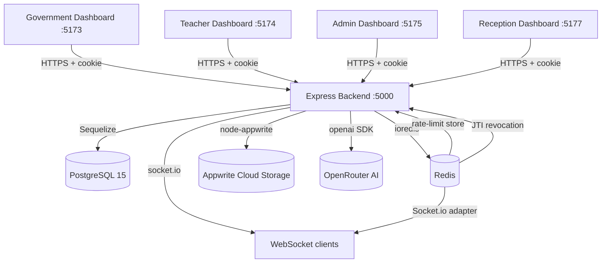
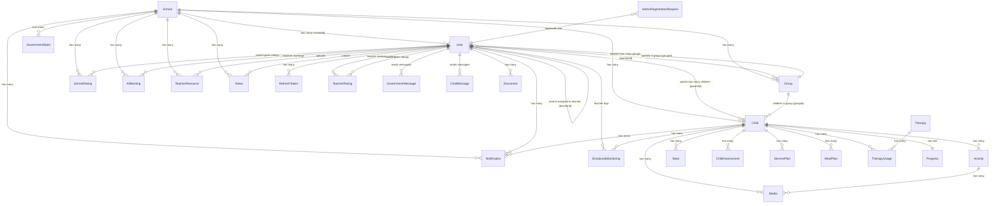

# Uchqun Platform — Complete Project Overview

> Generated: 2026-05-15. Based on full codebase read of `C:\work\Uchqun`.

---

## 1. Executive Summary

Uchqun ("spark" in Uzbek) is a government-owned, web-based management platform for special education schools in Uzbekistan. It replaces paper-based workflows with a multi-role digital system that tracks children with disabilities across school enrolment, daily activities, meals, therapy, media documentation, and parent communication.

**Domain:** Special education school management — student tracking, staff coordination, parent engagement, and government oversight.

**Users / Actors:**
- **Government** — top-level platform owner; views aggregate stats, manages Admin accounts, reads all messages.
- **Business** — analytics/reporting role with read-only aggregate visibility across schools.
- **Admin** — school-level administrator; manages Reception staff, approves their documents, reads teacher/parent data.
- **Reception** — school front-desk staff; creates Teacher and Parent accounts, manages Groups and Children.
- **Teacher** — classroom staff; logs daily activities, meals, media, manages therapy sessions, emotional monitoring.
- **Parent** — child's guardian; views their child's daily data (activities, meals, media), rates teachers and schools, chats.

**Deployment model:** Single-tenant SaaS hosted on Railway (backend) + Railway/Netlify (frontends). Multi-school isolation is achieved by `schoolId` column on every user/resource row — not separate DB schemas. No payment processing (state-funded).

---

## 2. Tech Stack (Exhaustive Table)

| Layer | Technology | Version | Purpose | Where configured |
|---|---|---|---|---|
| Language (backend) | JavaScript (ESM) | Node ≥ 20 | Server-side runtime | `backend/.nvmrc`, `package.json` `"type":"module"` |
| Runtime | Node.js | ≥ 20.0.0 | JavaScript runtime | `backend/.nvmrc` |
| Web framework | Express | ^4.18.2 | HTTP server, routing, middleware | `backend/server.js` |
| ORM | Sequelize | ^6.35.2 | PostgreSQL access, associations, named scopes | `backend/models/`, `backend/config/database.js` |
| Database | PostgreSQL | 15 | Primary data store | `docker-compose.yml`, Railway |
| Auth — JWT | jsonwebtoken | ^9.0.2 | Access token sign/verify | `backend/controllers/authController.js` |
| Auth — password | bcryptjs | ^3.0.3 | Password hashing (10 rounds) | `backend/models/User.js` |
| Cache / revocation | ioredis | ^5.10.1 | Redis for JTI revocation, rate-limit store, Socket adapter | `backend/utils/redisClient.js` |
| WebSocket | socket.io | ^4.8.3 | Real-time notifications | `backend/config/socket.js` |
| Socket scaling | @socket.io/redis-adapter | ^8.3.0 | Redis pub/sub fan-out | `backend/config/socket.js` |
| Input validation | express-validator | ^7.0.1 | Request body/param validation | `backend/validators/` |
| Schema validation | joi | ^17.11.0 | Additional schema checks | `backend/validators/` |
| Sanitization | sanitize-html | ^2.17.2 | Strip HTML from req.body | `backend/middleware/sanitize.js` |
| Rate limiting | express-rate-limit | ^7.1.5 | API, auth, upload, AI rate limits | `backend/middleware/rateLimiter.js` |
| Security headers | helmet | ^7.1.0 | CSP, HSTS, CORP | `backend/middleware/security.js` |
| File storage | Appwrite (node-appwrite) | ^24.1.0 | Cloud media/document storage | `backend/controllers/mediaController.js` |
| File upload | multer | ^2.1.1 | Multipart file handling | `backend/middleware/upload.js` |
| Image processing | sharp | ^0.33.0 | Thumbnail generation | `backend/controllers/mediaController.js` |
| AI chat | openai SDK | ^4.104.0 | Teacher/parent AI assistant via OpenRouter | `backend/controllers/teacherAIController.js` |
| Email | nodemailer | ^8.0.7 | Transactional email | (configured, usage in registration flow) |
| Logging | winston | ^3.11.0 | Structured JSON logs + PII redaction | `backend/utils/logger.js` |
| Error tracking | @sentry/node | ^10.37.0 | Production exception capture | `backend/utils/errorTracker.js` |
| HTTP client | axios | ^1.13.4 | Internal service calls / Appwrite proxy | `backend/package.json` |
| API docs | swagger-jsdoc + swagger-ui-express | ^6.2.8 / ^5.0.1 | `/api/v1/docs` (non-production) | `backend/config/swagger.js` |
| Testing (backend) | Jest | ^30.2.0 | Unit + integration tests | `backend/jest.config.js` |
| Testing (frontend) | Vitest | per-app | Component + service tests | each frontend `package.json` |
| HTTP testing | supertest | ^7.2.2 | Integration test HTTP assertions | `backend/__tests__/` |
| Linting | ESLint + eslint-plugin-security | ^8.55.0 | Static analysis incl. security rules | `backend/.eslintrc.cjs` |
| Pre-commit | Husky + lint-staged | ^9.1.7 | Auto-fix on commit | root `package.json`, `.husky/` |
| CI | GitHub Actions | — | Lint, SAST, test, build, deploy | `.github/workflows/ci.yml` |
| Secrets scan | gitleaks + Trivy | — | Hardcoded secret detection | `.github/workflows/ci.yml` |
| Containerization | Docker + docker-compose | postgres:15-alpine | Local dev DB + backend | `docker-compose.yml`, `backend/Dockerfile` |
| Deployment (backend) | Railway | — | Auto-deploy on main push | `.github/workflows/railway-deploy.yml` |
| Deployment (frontends) | Railway (all 4 apps) | — | Pre-built dist uploaded via railway CLI | `.github/workflows/railway-deploy.yml` |
| Frontend framework | React | (per-app package.json) | UI for all 4 dashboards | `admin/`, `teacher/`, `reception/`, `government/` |
| Frontend bundler | Vite | (per-app) | Dev server + production build | each app `vite.config.js` |
| Styling | Tailwind CSS | shared base | Utility-first CSS | `shared/tailwind.base.js` |
| Shared code | Custom workspace | — | `shared/` symlinked into each app | `shared/services/api.js`, `shared/context/`, `shared/hooks/`, `shared/components/` |

---

## 3. Repository Layout

```
C:\work\Uchqun/
├── CLAUDE.md                    # Developer operating manual + critical rules
├── README.md                    # Quick-start guide
├── docker-compose.yml           # Local dev: PostgreSQL 15 + backend
├── package.json                 # Root workspace: husky, lint-staged
├── .github/
│   └── workflows/
│       ├── ci.yml               # Lint → SAST → test → build (all apps)
│       └── railway-deploy.yml   # Auto-deploy backend + 4 frontends to Railway
├── .husky/                      # Pre-commit hooks
├── backend/                     # Express API server (Node.js + Sequelize)
│   ├── server.js                # Entry point: Express app, route mounting, Socket.io init
│   ├── config/
│   │   ├── database.js          # Sequelize instance (Railway URL or DB_* env vars)
│   │   ├── migrate.js           # Sequelize Umzug migration runner
│   │   ├── socket.js            # Socket.io server + Redis adapter + JWT auth middleware
│   │   ├── swagger.js           # OpenAPI spec
│   │   └── env.js               # Env var validation at startup
│   ├── controllers/             # Business logic handlers
│   │   ├── admin/               # (subdirectory — reserved, currently minimal)
│   │   ├── parent/              # (subdirectory — reserved, currently minimal)
│   │   ├── authController.js    # login, refresh, logout, getMe, setPassword
│   │   ├── adminController.js   # Admin + Government user management, school stats
│   │   ├── adminRegistrationController.js  # Self-registration for admin accounts
│   │   ├── aiWarningController.js          # AI-generated rating warnings
│   │   ├── businessController.js           # Business analytics
│   │   ├── chatController.js               # Teacher ↔ parent direct messages
│   │   ├── childAssessmentController.js    # Developmental assessments
│   │   ├── childController.js              # Child CRUD
│   │   ├── emotionalMonitoringController.js # Daily emotional state logs
│   │   ├── governmentController.js         # Platform-wide stats
│   │   ├── governmentMessageController.js  # Message thread system
│   │   ├── groupController.js              # Reception-managed classroom groups
│   │   ├── mealController.js               # Daily meal records
│   │   ├── mealPlanController.js           # Planned meal schedules
│   │   ├── mediaController.js              # Photo/video upload + Appwrite proxy
│   │   ├── newsController.js               # Admin-published news
│   │   ├── notificationController.js       # In-app notifications
│   │   ├── parentController.js             # Parent dashboard data
│   │   ├── parentEvaluationController.js   # Parent daily/weekly/monthly self-reports
│   │   ├── progressController.js           # Academic/social/behavioral progress JSONB
│   │   ├── receptionController.js          # Reception own document management
│   │   ├── receptionParentController.js    # Reception creates/manages parents + children
│   │   ├── receptionTeacherController.js   # Reception creates/manages teachers
│   │   ├── servicePlanController.js        # Individual education service plans
│   │   ├── teacherAIController.js          # AI advice endpoint for teachers
│   │   ├── teacherController.js            # Teacher dashboard, profiles, ratings
│   │   ├── teacherResourceController.js    # Video/audio/image learning resources
│   │   ├── teacherTaskController.js        # Responsibilities, tasks, work history
│   │   ├── therapyController.js            # Therapy catalogue + usage tracking
│   │   └── userController.js              # Profile update, password change, avatar
│   ├── middleware/
│   │   ├── auth.js              # authenticate, requireRole, requireTeacher, etc.
│   │   ├── errorHandler.js      # Global Express error handler
│   │   ├── rateLimiter.js       # apiLimiter, authLimiter, aiChatLimiter, uploadLimiter
│   │   ├── requestLogger.js     # HTTP request/response logging via Winston
│   │   ├── sanitize.js          # Strip HTML from req.body (sanitize-html)
│   │   ├── schoolScope.js       # requireSchoolScope, schoolWhere helpers
│   │   ├── security.js          # Helmet CSP + HTTPS enforcement
│   │   ├── upload.js            # Multer config for documents + media (Appwrite)
│   │   ├── uploadChildren.js    # Multer config for child photos + user avatars
│   │   └── validation.js        # handleValidationErrors (express-validator)
│   ├── models/                  # Sequelize models (35 models)
│   │   ├── index.js             # Model registry + all associations + named scopes
│   │   ├── User.js              # Core user model (6 roles, bcrypt hooks, soft-delete)
│   │   ├── School.js            # School entity
│   │   ├── Child.js             # Child/student entity
│   │   ├── Group.js             # Classroom group
│   │   ├── Activity.js          # Daily activity log
│   │   ├── Meal.js              # Daily meal record
│   │   ├── Media.js             # Photo/video metadata
│   │   ├── Notification.js      # In-app notification
│   │   ├── RefreshToken.js      # Hashed refresh token store
│   │   ├── AIWarning.js         # AI-generated warnings
│   │   ├── ChatMessage.js       # Direct messages
│   │   ├── Therapy.js           # Therapy catalogue entry
│   │   ├── TherapyUsage.js      # Therapy session (start/end)
│   │   ├── News.js              # Admin-published news items
│   │   ├── GovernmentMessage.js # Message threads to/from government
│   │   ├── EmotionalMonitoring.js # Child emotional state log
│   │   ├── ChildAssessment.js   # Developmental assessment record
│   │   ├── ServicePlan.js       # Individual education plan
│   │   ├── MealPlan.js          # Planned meals (template)
│   │   ├── Progress.js          # JSONB academic/social/behavioral progress
│   │   ├── TeacherResource.js   # Uploaded learning resources (video/audio/image)
│   │   ├── TeacherRating.js     # Parent → teacher rating
│   │   ├── SchoolRating.js      # Parent → school rating
│   │   ├── ParentEvaluation.js  # Parent self-assessment
│   │   ├── Document.js          # Reception uploaded documents
│   │   ├── AdminRegistrationRequest.js # Self-registration requests
│   │   ├── GovernmentStats.js   # Snapshot stats records
│   │   ├── BusinessStats.js     # Business analytics snapshots
│   │   ├── ParentActivity.js    # Parent-side activity view (denorm)
│   │   ├── ParentMeal.js        # Parent-side meal view (denorm)
│   │   ├── ParentMedia.js       # Parent-side media view (denorm)
│   │   ├── TeacherResponsibility.js # Teacher duty assignments
│   │   ├── TeacherTask.js       # Task assigned to teacher
│   │   └── TeacherWorkHistory.js # Teacher task completion history
│   ├── migrations/              # 50 Sequelize migration files (Umzug runner)
│   ├── routes/                  # Express routers (25 route files)
│   ├── scripts/                 # One-off admin scripts (seed, create accounts, etc.)
│   ├── utils/
│   │   ├── logger.js            # Winston instance with PII redaction
│   │   ├── errorTracker.js      # Sentry init + captureException helper
│   │   ├── redisClient.js       # ioredis singleton (optional)
│   │   ├── redisRateLimitStore.js # express-rate-limit ↔ Redis adapter
│   │   └── loginRateLimitStore.js # Per-email lockout (Redis or in-memory)
│   ├── validators/              # express-validator chain definitions
│   ├── __tests__/               # Jest test files
│   │   └── controllers/         # Controller integration tests
│   ├── jest.config.js
│   ├── server.js
│   ├── Dockerfile
│   ├── railway.toml
│   └── nixpacks.toml
├── admin/                       # React dashboard — school admin (port 5175)
├── teacher/                     # React dashboard — teachers + parent UI (port 5174)
├── reception/                   # React dashboard — front-desk staff (port 5177)
├── government/                  # React dashboard — government oversight (port 5173)
├── shared/
│   ├── services/
│   │   ├── api.js               # Axios instance (withCredentials: true, base URL from VITE_API_URL)
│   │   └── config.js            # Shared config constants
│   ├── components/              # Shared React components
│   ├── context/                 # Shared React contexts (AuthContext, etc.)
│   ├── hooks/                   # Shared React hooks
│   ├── locales/                 # i18n translation files (uz/ru/en)
│   └── tailwind.base.js         # Shared Tailwind configuration
├── audit/                       # Security audit reports
└── node_modules/                # Root workspace node_modules
```

**Monorepo structure:** A single Git repo containing 1 backend + 4 frontend applications + 1 shared library. No Yarn/npm workspaces are declared — frontends import from `../shared` via relative paths. The root `package.json` installs only Husky and lint-staged; each app installs its own dependencies.

---

## 4. Architecture

### High-Level Diagram



### Request Lifecycle

```
Browser
  │ HTTP request (cookie: accessToken=<JWT>)
  ▼
Express app (server.js)
  │ app.set('trust proxy', 1)
  │ securityHeaders (Helmet)
  │ enforceHTTPS (production redirect)
  │ CORS check (origin allowlist)
  │ requestLogger
  │ express.json / urlencoded
  │ cookieParser
  │ sanitizeBody (strip HTML)
  │ apiLimiter (rate-limit /api/*)
  ▼
Router (e.g. /api/v1/teacher)
  │ authenticate middleware
  │   → extract JWT from cookie or Authorization header
  │   → jwt.verify(token, JWT_SECRET)
  │   → check JTI not revoked (Redis/in-memory)
  │   → load user from DB (30s in-memory cache)
  │   → check isActive (non-parent, non-government)
  │   → check reception documentsApproved
  │ requireRole / requireTeacher middleware
  │ requireSchoolScope (optional) → sets req.schoolId
  ▼
Controller
  │ Input validation (express-validator, Joi)
  │ Business logic
  │ Sequelize query (with schoolId WHERE clause where needed)
  ▼
PostgreSQL
  ▼
Response JSON
  │ notFound / errorHandler middleware
  ▼
Browser
```

### Background Jobs / Cron

There are **no scheduled background jobs** configured in the codebase. There is no bull, node-cron, or similar scheduler. All operations are request-driven.

The only near-background operation is the optional migration runner on startup (controlled by `RUN_MIGRATIONS=true` env var), which runs `config/migrate.js` after the server starts listening.

### External Integrations

| Service | Purpose | Credentials | Code location |
|---|---|---|---|
| Appwrite Cloud | Media file storage (photos, videos, documents) | `APPWRITE_ENDPOINT`, `APPWRITE_PROJECT_ID`, `APPWRITE_API_KEY`, `APPWRITE_BUCKET_ID` | `backend/controllers/mediaController.js`, `backend/middleware/upload.js` |
| OpenRouter (OpenAI-compatible) | AI chat advice for teachers and parents | `OPENAI_API_KEY`, `OPENAI_BASE_URL`, `OPENAI_MODEL` | `backend/controllers/teacherAIController.js`, `backend/controllers/parentController.js` |
| Redis (Railway) | JTI revocation, rate-limit counters, Socket.io pub/sub | `REDIS_URL` | `backend/utils/redisClient.js` |
| Sentry | Exception tracking in production | `SENTRY_DSN` | `backend/utils/errorTracker.js` |
| Nodemailer | Transactional email (registration flow) | SMTP config (not in env.example — see scripts) | `backend/scripts/` |
| Telegram | Bot notifications (configured but usage not in main controllers) | `TELEGRAM_BOT_TOKEN`, `TELEGRAM_CHANNEL_ID` | `backend/env.example` |
| Railway | Backend + frontend hosting | `RAILWAY_TOKEN` (GitHub secret) | `.github/workflows/railway-deploy.yml` |

---

## 5. Database

### Engine and Version

**PostgreSQL 15** (alpine image in Docker; Railway-managed in production).

Connection: `DATABASE_URL` (Railway private network) or individual `DB_*` env vars. SSL enabled for Railway with `rejectUnauthorized: false` (self-signed cert).

Pool: max 20 connections, 60s acquire timeout, 10s idle timeout.

### Full Schema

All tables use UUID primary keys (`gen_random_uuid()` default via Sequelize `DataTypes.UUIDV4`). Timestamps: `createdAt` / `updatedAt` on all tables. Soft-delete (`paranoid: true`) tables also have `deleted_at`.

#### `users`
| Column | Type | Null | Default | Notes |
|---|---|---|---|---|
| id | UUID | NOT NULL | UUIDV4 | PK |
| email | STRING | NOT NULL | — | UNIQUE, indexed |
| password | STRING | NOT NULL | — | bcrypt hash (10 rounds), never returned in JSON |
| firstName | STRING | NOT NULL | — | |
| lastName | STRING | NOT NULL | — | |
| phone | STRING | NULL | — | |
| role | ENUM | NOT NULL | 'parent' | `admin,reception,teacher,parent,government,business` |
| isVerified | BOOLEAN | NOT NULL | false | Document verified flag (Reception) |
| documentsApproved | BOOLEAN | NOT NULL | false | Admin approved flag (Reception) |
| isActive | BOOLEAN | NOT NULL | false | Can login flag |
| avatar | TEXT | NULL | — | URL to avatar image |
| notificationPreferences | JSONB | — | `{email:true,push:false}` | |
| teacherId | UUID | NULL | — | FK → users.id (parent → teacher assignment) |
| groupId | UUID | NULL | — | FK → groups.id |
| createdBy | UUID | NULL | — | FK → users.id (reception who created) |
| schoolId | UUID | NULL | — | FK → schools.id (NULL for government) |
| rating | FLOAT | NULL | 0 | Teacher rating average (0–5) |
| totalRatings | INTEGER | NULL | 0 | Count of ratings |
| createdAt | DATE | NOT NULL | NOW() | |
| updatedAt | DATE | NOT NULL | NOW() | |
| deleted_at | DATE | NULL | — | Soft-delete (paranoid) |

Named scopes: `active`, `bySchool(schoolId)`, `teachers`, `parents`.

#### `schools`
| Column | Type | Null | Default | Notes |
|---|---|---|---|---|
| id | UUID | NOT NULL | UUIDV4 | PK |
| name | STRING(500) | NOT NULL | — | Indexed |
| type | ENUM | NOT NULL | 'both' | `school,kindergarten,both` |
| address | TEXT | NULL | — | |
| phone | STRING(255) | NULL | — | |
| email | STRING(255) | NULL | — | |
| description | TEXT | NULL | — | |
| isActive | BOOLEAN | NOT NULL | true | Indexed |

#### `children`
| Column | Type | Null | Default | Notes |
|---|---|---|---|---|
| id | UUID | NOT NULL | UUIDV4 | PK |
| parentId | UUID | NOT NULL | — | FK → users.id CASCADE |
| firstName | STRING | NOT NULL | — | |
| lastName | STRING | NOT NULL | — | |
| dateOfBirth | DATEONLY | NOT NULL | — | |
| gender | ENUM | NOT NULL | — | `Male,Female,Other` |
| disabilityType | STRING(500) | NOT NULL | — | |
| specialNeeds | TEXT | NULL | — | |
| photo | TEXT | NULL | — | |
| schoolId | UUID | NULL | — | FK → schools.id |
| class | STRING(255) | NOT NULL | — | |
| teacher | STRING(255) | NOT NULL | — | Legacy text field (pre-FK era) |
| groupId | UUID | NULL | — | FK → groups.id |
| medicalDiagnosis | STRING(500) | NULL | — | |
| institutionStartDate | DATEONLY | NULL | — | |
| fatherFullName | STRING(255) | NULL | — | |
| fatherDOB | DATEONLY | NULL | — | |
| fatherOccupation | STRING(255) | NULL | — | |
| motherFullName | STRING(255) | NULL | — | |
| motherDOB | DATEONLY | NULL | — | |
| motherOccupation | STRING(255) | NULL | — | |
| address | TEXT | NULL | — | |
| contactPhone | STRING(50) | NULL | — | |
| childDescription | TEXT | NULL | — | |
| expectedOutcomes | TEXT | NULL | — | |
| emergencyContact | JSONB | NOT NULL | `{}` | |
| deleted_at | DATE | NULL | — | Soft-delete |

Named scope: `bySchool(schoolId)`.

#### `groups`
| Column | Type | Null | Default | Notes |
|---|---|---|---|---|
| id | UUID | NOT NULL | UUIDV4 | PK |
| name | STRING(255) | NOT NULL | — | Indexed |
| description | TEXT | NULL | — | |
| teacherId | UUID | NOT NULL | — | FK → users.id (teacher), indexed |
| capacity | INTEGER | NOT NULL | 20 | 1–100 |
| ageRange | STRING(50) | NULL | — | |
| schoolId | UUID | NULL | — | FK → schools.id |

#### `activities`
| Column | Type | Null | Default | Notes |
|---|---|---|---|---|
| id | UUID | NOT NULL | UUIDV4 | PK |
| childId | UUID | NOT NULL | — | FK → children.id CASCADE, indexed w/ date |
| date | DATEONLY | NOT NULL | CURRENT_DATE | |
| title | STRING(500) | NOT NULL | — | |
| description | TEXT | NOT NULL | — | |
| type | ENUM | NOT NULL | — | `Learning,Therapy,Social,Physical,Other` |
| duration | INTEGER | NOT NULL | — | minutes |
| teacher | STRING(255) | NOT NULL | — | Legacy text field |
| studentEngagement | ENUM | NULL | 'Medium' | `High,Medium,Low` |
| notes | TEXT | NULL | — | |
| schoolId | UUID | NULL | — | Via Child.schoolId (not direct column) |

Named scopes: `byChild(childId)`, `bySchool(schoolId)` (via JOIN on child).

#### `meals`
| Column | Type | Null | Default | Notes |
|---|---|---|---|---|
| id | UUID | NOT NULL | UUIDV4 | PK |
| childId | UUID | NOT NULL | — | FK → children.id CASCADE, indexed w/ date |
| date | DATEONLY | NOT NULL | CURRENT_DATE | |
| mealType | ENUM | NOT NULL | — | `Breakfast,Lunch,Snack,Dinner` |
| mealName | STRING(500) | NOT NULL | — | |
| description | TEXT | NULL | — | |
| quantity | STRING(255) | NULL | — | |
| specialNotes | TEXT | NULL | — | |
| time | TIME | NULL | — | |
| eaten | BOOLEAN | NULL | true | |

Named scopes: `byChild(childId)`, `bySchool(schoolId)`.

#### `media`
| Column | Type | Null | Default | Notes |
|---|---|---|---|---|
| id | UUID | NOT NULL | UUIDV4 | PK |
| childId | UUID | NOT NULL | — | FK → children.id CASCADE, indexed w/ date |
| activityId | UUID | NULL | — | FK → activities.id SET NULL |
| type | ENUM | NOT NULL | — | `photo,video` |
| url | TEXT | NOT NULL | — | Appwrite file URL or local /uploads path |
| thumbnail | TEXT | NULL | — | |
| title | STRING(500) | NULL | — | |
| description | TEXT | NULL | — | |
| date | DATEONLY | NOT NULL | CURRENT_DATE | |

Named scopes: `byChild(childId)`, `bySchool(schoolId)`.

#### `notifications`
| Column | Type | Null | Default | Notes |
|---|---|---|---|---|
| id | UUID | NOT NULL | UUIDV4 | PK |
| userId | UUID | NOT NULL | — | FK → users.id CASCADE, indexed w/ isRead |
| childId | UUID | NULL | — | FK → children.id CASCADE |
| type | ENUM | NOT NULL | — | `activity,meal,media,progress,general` |
| title | STRING(500) | NOT NULL | — | |
| message | TEXT | NOT NULL | — | |
| relatedId | UUID | NULL | — | Polymorphic — no DB FK |
| relatedType | ENUM | NULL | — | `activity,meal,media,progress` |
| isRead | BOOLEAN | — | false | |
| readAt | DATE | NULL | — | |
| schoolId | UUID | NULL | — | FK → schools.id SET NULL |

#### `refresh_tokens`
| Column | Type | Null | Default | Notes |
|---|---|---|---|---|
| id | UUID | NOT NULL | UUIDV4 | PK |
| token_hash | STRING | NOT NULL | — | SHA-256 of raw token |
| user_id | UUID | NOT NULL | — | FK → users.id CASCADE |
| expires_at | DATE | NOT NULL | — | |
| revoked | BOOLEAN | NOT NULL | false | |
| revoked_at | DATE | NULL | — | |

#### `therapies`
| Column | Type | Null | Default | Notes |
|---|---|---|---|---|
| id | UUID | NOT NULL | UUIDV4 | PK |
| title | STRING(500) | NOT NULL | — | |
| description | TEXT | NULL | — | |
| therapyType | ENUM | NOT NULL | — | `music,video,content,art,physical,speech,occupational,other` |
| contentUrl | TEXT | NULL | — | |
| contentType | ENUM | NULL | — | `audio,video,image,document,interactive,link` |
| duration | INTEGER | NULL | — | minutes |
| ageGroup | ENUM | NOT NULL | 'all' | `infant,toddler,preschool,school_age,adolescent,all` |
| difficultyLevel | ENUM | NOT NULL | 'all' | `beginner,intermediate,advanced,all` |
| tags | ARRAY(STRING) | NULL | `[]` | |
| createdBy | UUID | NULL | — | FK → users.id SET NULL |
| isActive | BOOLEAN | NOT NULL | true | |
| usageCount | INTEGER | NOT NULL | 0 | |
| rating | DECIMAL(3,2) | NULL | 0 | 0–5 |
| ratingCount | INTEGER | NOT NULL | 0 | |
| deleted_at | DATE | NULL | — | Soft-delete |

#### `ai_warnings`
| Column | Type | Null | Default | Notes |
|---|---|---|---|---|
| id | UUID | NOT NULL | UUIDV4 | PK |
| warningType | ENUM | NOT NULL | — | `low_rating,declining_rating,negative_feedback,complaint,safety_concern,quality_issue,other` |
| severity | ENUM | NOT NULL | 'medium' | `low,medium,high,critical` |
| targetType | ENUM | NOT NULL | — | `school,parent,teacher,child` |
| targetId | UUID | NOT NULL | — | Polymorphic — no DB FK |
| schoolId | UUID | NULL | — | FK → schools.id |
| parentId | UUID | NULL | — | FK → users.id |
| title | STRING(500) | NOT NULL | — | |
| message | TEXT | NOT NULL | — | |
| aiAnalysis | TEXT | NULL | — | Raw AI output |
| ratingData | JSONB | NULL | — | Input data snapshot |
| isResolved | BOOLEAN | NOT NULL | false | |
| resolvedAt | DATE | NULL | — | |
| resolvedBy | UUID | NULL | — | FK → users.id |
| resolutionNotes | TEXT | NULL | — | |
| notifiedUsers | ARRAY(UUID) | NULL | `[]` | |

#### `news`
| Column | Type | Null | Default | Notes |
|---|---|---|---|---|
| id | UUID | NOT NULL | UUIDV4 | PK |
| title | STRING(500) | NOT NULL | — | |
| content | TEXT | NOT NULL | — | |
| published | BOOLEAN | NOT NULL | false | |
| targetAudience | ENUM | NOT NULL | 'all' | `all,parents,teachers,admins` |
| createdById | UUID | NULL | — | FK → users.id SET NULL |
| schoolId | UUID | NULL | — | FK → schools.id SET NULL |

#### Other tables (abbreviated)

| Table | Purpose | Key columns |
|---|---|---|
| `chat_messages` | Direct teacher↔parent messaging | senderId, receiverId, content, isRead |
| `government_messages` | Message threads to government | senderId, subject, message, parentMessageId, isRead, repliedBy |
| `admin_registration_requests` | Self-registration requests | email, requestedSchoolName, status, reviewedBy, approvedUserId, schoolId |
| `documents` | Reception uploaded documents | userId, type, fileUrl, status, reviewedBy |
| `emotional_monitoring` | Daily emotional state | childId, teacherId, date, emotionalState, notes |
| `child_assessments` | Developmental assessments | childId, teacherId, assessmentType, score, notes |
| `service_plans` | Individual education plans | childId, goals, createdBy |
| `meal_plans` | Planned meal templates | childId, type (daily/weekly/monthly), items (JSONB) |
| `progress` | Academic/social/behavioral progress | childId (UNIQUE), academic/social/behavioral (JSONB) |
| `teacher_ratings` | Parent → teacher ratings | parentId, teacherId, rating (1–5), comment |
| `school_ratings` | Parent → school ratings | parentId, schoolId, stars (NOT NULL), evaluation text |
| `parent_evaluations` | Parent self-assessments | parentId, teacherId, type (daily/weekly/monthly), data (JSONB) |
| `teacher_responsibilities` | Teacher duty assignments | teacherId, title, description, dueDate |
| `teacher_tasks` | Tasks assigned to teachers | teacherId, title, status |
| `teacher_work_history` | Completed tasks/work entries | teacherId, description, status |
| `teacher_resources` | Uploaded learning resources | teacherId, schoolId, title, fileUrl, fileType |
| `therapy_usages` | Therapy session tracking | therapyId, parentId, teacherId, childId, startedAt, endedAt |
| `government_stats` | Snapshot stats records | schoolId, generatedBy, data (JSONB) |
| `business_stats` | Business analytics snapshots | businessId, data (JSONB) |

### Relationships Diagram



### Migration Strategy

- **Runner:** Sequelize + Umzug (`backend/config/migrate.js`). Not `sequelize-cli`.
- **Run locally:** `cd backend && npm run migrate` — executes all pending migrations.
- **Run on Railway:** `npm run start:migrate` (runs migrate then starts server). Also triggerable via `POST /api/v1/migrations/run` with `x-migration-secret` header.
- **Undo:** Manual — no automated rollback. `migrate:undo` script prints a message to check migrations directory.
- **50 migrations total** from initial schema (2024-01-01) to latest (2026-05-14).

### Seed Data

- `backend/scripts/seed.js` — creates demo data.
- One-off scripts: `create-admin.js`, `create-teacher.js`, `create-government.js`, `create-demo-accounts.js`, `create-reception.js`.
- Passwords reset via migration files that UPDATE the `users` table with pre-computed bcrypt hashes.

### Tenant Isolation at DB Level

**Shared schema with `schoolId` column.** There is no schema-per-tenant, database-per-tenant, or PostgreSQL RLS. Every relevant table has a `schoolId` UUID foreign key. Isolation is enforced at the application layer via the `schoolWhere(req)` helper and `requireSchoolScope` middleware.

---

## 6. Multi-Tenancy / Tenant Isolation

### How a Tenant (School) Is Identified Per Request

The school identity is embedded in the authenticated user record. Every user (except `government`) has a `schoolId` column. After JWT verification, the user is loaded from DB (with 30s cache), and `user.schoolId` becomes the tenant boundary.

There is no subdomain, header, or path-param based tenant resolution.

### Where Tenant Context Is Set

**`backend/middleware/schoolScope.js` (entire file, 33 lines):**

```js
// backend/middleware/schoolScope.js
export const requireSchoolScope = (req, res, next) => {
  if (!req.user) {
    return res.status(401).json({ error: 'Authentication required' });
  }

  const { role, schoolId } = req.user;

  if (role === 'government') {
    req.schoolId = schoolId || null;
    req.isGlobalAccess = true;
    return next();
  }

  if (!schoolId) {
    return res.status(403).json({ error: 'Account not fully configured. School assignment required.' });
  }

  req.schoolId = schoolId;
  req.isGlobalAccess = false;
  next();
};

export const schoolWhere = (req) => {
  if (!req.user) return {};
  const { role, schoolId } = req.user;
  if (role === 'government') return {};
  if (!schoolId) return {};
  return { schoolId };
};
```

`requireSchoolScope` is mounted as route-level middleware on routes that need it. `schoolWhere(req)` is called inside controllers to build Sequelize `where` clauses.

### How DB Queries Are Scoped to a School

Controllers call `schoolWhere(req)` and spread it into their Sequelize queries. Example pattern:

```js
// backend/controllers/activityController.js (typical pattern)
const activities = await Activity.scope('bySchool', req.schoolId).findAll({
  where: { ...schoolWhere(req), ... },
  ...
});
```

Named scopes on `Child`, `Activity`, `Meal`, `Media` in `models/index.js` (lines 259–271) add a JOIN on `children.schoolId` for resources that don't have a direct `schoolId` column:

```js
// backend/models/index.js:260-271
Activity.addScope('bySchool', (schoolId) => ({
  include: [{ model: Child, as: 'child', where: { schoolId }, required: true, attributes: [] }],
}));
```

### Cross-Tenant Operations (Government)

Government users set `req.isGlobalAccess = true` and `schoolWhere(req)` returns `{}` (no WHERE clause). Government can see all schools, all admins, all users across the platform.

The `business` role also has cross-school aggregate visibility via `GET /api/v1/business/overview` etc., but only read access.

### What Happens If Tenant Context Is Missing

- If a non-government user has no `schoolId`: `requireSchoolScope` returns HTTP 403 "Account not fully configured."
- If `schoolWhere` is called without the middleware (defensive): returns `{}`, which would inadvertently allow cross-school access — a risk if a controller omits the middleware guard.

⚠️ **Open Question:** Not all routes apply `requireSchoolScope`. Some controllers manually call `schoolWhere(req)` without the middleware guard. If a controller forgets to include `schoolWhere` in its query, cross-school data leakage is possible.

---

## 7. Authentication

### Auth Method

**JWT (HTTP-only cookies) + Refresh Token rotation.**

- Access token: JWT signed with `JWT_SECRET`, 15-minute expiry, delivered as HTTP-only cookie (`accessToken`).
- Refresh token: 40-byte random hex string, SHA-256 hashed and stored in `refresh_tokens` table, 7-day expiry, delivered as HTTP-only cookie (`refreshToken`).

### Token Structure (Access Token)

```js
// backend/controllers/authController.js:13-18
const generateAccessToken = (userId) => {
  return jwt.sign(
    { userId, jti: crypto.randomUUID() },
    process.env.JWT_SECRET,
    { expiresIn: '15m' }
  );
};
```

**JWT payload fields:**
| Claim | Type | Description |
|---|---|---|
| `userId` | UUID string | User's primary key |
| `jti` | UUID string | Unique token ID for revocation |
| `iat` | number | Issued at (Unix timestamp) |
| `exp` | number | Expiry (iat + 900 seconds) |

No role is embedded in the token. The role is fetched from the DB on every request via `getCachedUser(decoded.userId)`.

### Token Issuance Flow (Login)

```
POST /api/v1/auth/login { email, password }
  1. Normalize email (lowercase + trim)
  2. Check per-email lockout (Redis or in-memory): 429 if locked
  3. Find user by email (exact, then iLike fallback)
  4. Validate password hash starts with $2 (bcrypt)
  5. bcrypt.compare(password, user.password)
  6. If reception: check documentsApproved && isActive
  7. If admin: check isActive
  8. clearAttempts(email)
  9. generateAccessToken(user.id) → JWT (15m)
  10. generateRefreshToken(user.id) → insert refresh_tokens row, return raw token
  11. Set cookies: accessToken (httpOnly, 15m) + refreshToken (httpOnly, 7d)
  12. Response: { success: true, expiresIn: '15m', user: user.toJSON() }
```

### Token Storage

Both tokens are stored as **HTTP-only cookies**. In production: `secure: true, sameSite: 'none'`. In development: `secure: false, sameSite: 'lax'`. Clients never have JavaScript access to these cookies.

The frontend also accepts a `Bearer` token in the `Authorization` header as fallback (`authenticate` middleware: `backend/middleware/auth.js:69-74`).

### Password Handling

- Algorithm: **bcrypt** via `bcryptjs` library.
- Rounds: **10** (standard, ~100ms on modern hardware).
- Hashing happens in Sequelize model hooks: `beforeCreate` and `beforeUpdate` (only when password field changes).
- Validation: minimum 8 characters, must contain uppercase, lowercase, and digit (enforced in `setPassword` endpoint).
- `toJSON()` method on User always deletes the password field before serialization.

### Session / Refresh Mechanics

```
POST /api/v1/auth/refresh { refreshToken } (or via cookie)
  1. Extract raw refresh token from body or cookie
  2. Optionally decode expired access token (ignoreExpiration: true) to get userId
  3. SHA-256 hash the raw token → look up refresh_tokens by tokenHash + revoked=false
  4. Check not expired
  5. Mark old refresh token as revoked (rotation: one-time use)
  6. Issue new access token + new refresh token
  7. Set new cookies
```

### Logout Flow

```
POST /api/v1/auth/logout (requires authenticate)
  1. Revoke all refresh tokens for user (UPDATE refresh_tokens SET revoked=true)
  2. Revoke access token JTI in Redis (or in-memory) with TTL = token remaining lifetime
  3. Clear accessToken and refreshToken cookies
  4. Response: { success: true }
```

### Set Password Flow

Used for initial password setup (reception accounts created by admin get a set-password JWT link):

```
POST /api/v1/auth/set-password { token, password }
  1. jwt.verify(token, JWT_SECRET) — same secret as access tokens
  2. Check decoded.purpose === 'set-password'
  3. Validate password complexity
  4. Update user.password (triggers bcrypt beforeUpdate hook)
```

---

## 8. Authorization — Roles & Permissions

### Role Definitions

**`backend/models/User.js:36-39`:**
```js
role: {
  type: DataTypes.ENUM('admin', 'reception', 'teacher', 'parent', 'government', 'business'),
  defaultValue: 'parent',
  allowNull: false,
},
```

#### Role: `government`

| Attribute | Value |
|---|---|
| Where defined | `User.role` ENUM, `backend/models/User.js:36` |
| How assigned | Created by `POST /api/v1/government/users` (another government user) or initial setup script |
| Scope | Global — no schoolId required |
| schoolId | NULL (can be set but `schoolWhere` returns `{}` regardless) |

**Permissions:**
- All `GET /api/v1/government/*` endpoints (stats, schools, students, teachers, parents, ratings)
- Full CRUD on Admin accounts
- Full CRUD on other Government accounts
- Read + reply on all messages from any role
- Approve/reject Admin registration requests
- Resolve AI warnings
- View Business analytics endpoints (shared with `business` role)

**Guard:** `requireGovernment = requireRole('government')` — `backend/middleware/auth.js:147`.

#### Role: `business`

| Attribute | Value |
|---|---|
| Where defined | `User.role` ENUM |
| How assigned | Created by Government via (presumably migration or script — no dedicated endpoint found) |
| Scope | Cross-school read-only analytics |

**Permissions:**
- `GET /api/v1/business/overview`, `/users`, `/usage`, `/stats`
- `POST /api/v1/business/stats/generate`

**Guard:** `requireRole('business', 'government')` — `backend/routes/businessRoutes.js:16`.

#### Role: `admin`

| Attribute | Value |
|---|---|
| Where defined | `User.role` ENUM |
| How assigned | Created by Government via `POST /api/v1/government/admins`; must be `isActive=true` to login |
| Scope | Per-school |

**Permissions:**
- Full CRUD on Reception accounts
- Approve/reject Reception documents
- Activate/deactivate Reception
- Read-only: Teachers, Parents, Groups
- View school statistics
- View school ratings
- Create/update/delete news items
- Analyze/resolve AI warnings
- Create therapies
- View all data within their school
- Send messages to Government

**Guard:** `requireAdmin = requireRole('admin')` — `backend/middleware/auth.js:132`.

#### Role: `reception`

| Attribute | Value |
|---|---|
| Where defined | `User.role` ENUM |
| How assigned | Created by Admin via `POST /api/v1/admin/receptions`. Requires Admin document approval before login. |
| Scope | Per-school |
| Special activation | `documentsApproved=true && isActive=true` required for login AND on every authenticated request |

**Permissions:**
- Upload own documents
- Full CRUD on Teacher accounts (within school)
- Full CRUD on Parent accounts + Children (within school)
- Create/update/delete Groups
- Read groups list
- Send messages to Government
- `requireTeacher` routes (reception is in `['teacher', 'reception', 'admin']`) — can view teacher-scoped resources

**Guard:** `requireReception = requireRole('reception')` — `backend/middleware/auth.js:133`.

#### Role: `teacher`

| Attribute | Value |
|---|---|
| Where defined | `User.role` ENUM |
| How assigned | Created by Reception via `POST /api/v1/reception/teachers` |
| Scope | Per-school |

**Permissions:**
- View own profile and dashboard
- Read own responsibilities, tasks, work history
- Update task/work history status
- Read-only on Parents within school
- View own groups
- View own ratings
- AI chat (rate-limited: 20 req/min in production)
- Create/update/delete Activities, Meals (for children in their scope)
- Create/update/delete Media
- CRUD on Emotional Monitoring
- Create/update Assessments
- Create/update Service Plans and Meal Plans
- Start/end Therapy usage
- Create Therapies
- Upload Teacher Resources
- Send/receive chat messages
- Send messages to Government

**Guard:** `requireTeacher` — allows `['teacher', 'reception', 'admin']`:
```js
// backend/middleware/auth.js:135-143
export const requireTeacher = (req, res, next) => {
  if (!req.user) {
    return res.status(401).json({ error: 'Authentication required' });
  }
  if (['teacher', 'reception', 'admin'].includes(req.user.role)) {
    return next();
  }
  return res.status(403).json({ error: 'Insufficient permissions' });
};
```

#### Role: `parent`

| Attribute | Value |
|---|---|
| Where defined | `User.role` ENUM |
| How assigned | Created by Reception via `POST /api/v1/reception/parents`. Auto-set `isActive=true` by Reception. |
| Scope | Per-school, but primarily scoped to their own children |

**Permissions:**
- View own children
- View own activities, meals, media (filtered by their children)
- View own profile
- Rate teacher (once, per their assigned teacher)
- Rate school
- Submit parent evaluations (daily/weekly/monthly)
- View school list
- AI chat (rate-limited)
- Read emotional monitoring for own children
- Send/receive direct chat messages with teacher
- Send messages to Government

**Special case:** `isActive` is NOT checked for parents in `authenticate` middleware (line 93–98 in `auth.js` shows parents are exempted from the active check).

**Guard:** `requireParent = requireRole('parent')` — `backend/middleware/auth.js:145`.

### Role Hierarchy Summary

```
government  (global access, all schools)
    └── creates → admin (per-school)
business    (global read-only analytics)
admin       (per-school, manages reception)
    └── creates → reception (per-school, needs approval)
reception   (per-school, manages teachers + parents)
    ├── creates → teacher (per-school)
    └── creates → parent (per-school) + children
teacher     (per-school, logs child data)
parent      (per-school, views own child data)
```

### Permission Enforcement Pattern

1. **Route-level middleware:** `requireRole('admin')`, `requireTeacher`, `requireGovernment`, etc.
2. **Custom function for teacher + reception + admin overlap:** `requireTeacher`.
3. **School scope guard:** `requireSchoolScope` sets `req.schoolId`; controllers use `schoolWhere(req)`.
4. **No CASL / ABAC policy engine** — pure custom middleware.

---

## 9. Features (Functional Inventory)

### 9.1 Authentication (`/api/v1/auth`)

Handles login, refresh, logout, profile retrieval, and password set.

**Routes:**

| Method | Path | Auth | Role | Description |
|---|---|---|---|---|
| POST | `/login` | No | Any | Email/password login |
| POST | `/refresh` | No | Any | Refresh access token using refresh cookie |
| POST | `/set-password` | No | Any | Set password via one-time JWT token |
| GET | `/me` | Yes | Any | Get current user profile |
| POST | `/logout` | Yes | Any | Revoke tokens, clear cookies |
| POST | `/admin-register` | No | — | Self-registration request with document upload |

### 9.2 Admin Management (`/api/v1/admin`)

School-level admin operations. All routes require `admin` role.

**Routes:**

| Method | Path | Description |
|---|---|---|
| POST | `/message-to-government` | Send message thread to government |
| GET | `/messages` | View own messages to government |
| POST | `/receptions` | Create Reception account |
| GET | `/receptions` | List Reception accounts |
| GET | `/receptions/:id` | Get Reception details |
| PUT | `/receptions/:id` | Update Reception |
| DELETE | `/receptions/:id` | Delete Reception |
| PUT | `/receptions/:id/activate` | Activate Reception |
| PUT | `/receptions/:id/deactivate` | Deactivate Reception |
| GET | `/documents/pending` | List pending document reviews |
| GET | `/receptions/:id/documents` | List specific reception's documents |
| PUT | `/documents/:id/approve` | Approve a document |
| PUT | `/documents/:id/reject` | Reject a document (with reason) |
| GET | `/teachers` | View teachers in school (read-only) |
| GET | `/parents` | View parents in school (read-only) |
| GET | `/parents/:id` | View parent + their data |
| GET | `/groups` | View groups in school |
| GET | `/groups/:id` | View specific group |
| GET | `/statistics` | School-level statistics |
| GET | `/school-ratings` | School ratings from parents |

### 9.3 Reception Management (`/api/v1/reception`)

Front-desk staff operations. All routes require `reception` role.

**Routes:**

| Method | Path | Description |
|---|---|---|
| POST | `/documents` | Upload reception document (file) |
| GET | `/documents` | List own documents |
| GET | `/verification-status` | Check own approval status |
| POST | `/teachers` | Create teacher account |
| GET | `/teachers` | List teachers in school |
| GET | `/teachers/:id/ratings` | View teacher ratings |
| PUT | `/teachers/:id` | Update teacher |
| DELETE | `/teachers/:id` | Delete teacher |
| POST | `/parents` | Create parent + child (multipart) |
| GET | `/parents` | List parents in school |
| PUT | `/parents/:id` | Update parent |
| DELETE | `/parents/:id` | Delete parent |
| POST | `/children` | Add child to existing parent |
| PUT | `/children/:id` | Update child |
| DELETE | `/children/:id` | Delete child |
| GET | `/groups` | List groups |
| POST | `/message-to-government` | Send message to government |
| GET | `/messages` | View own messages |

### 9.4 Teacher Dashboard (`/api/v1/teacher`)

Classroom staff operations. Routes require `requireTeacher` (teacher + reception + admin).

| Method | Path | Description |
|---|---|---|
| GET | `/profile` | Own profile |
| GET | `/dashboard` | Dashboard summary |
| GET | `/responsibilities` | Own assigned responsibilities |
| GET | `/responsibilities/:id` | Specific responsibility |
| GET | `/tasks` | Own tasks |
| GET | `/tasks/:id` | Specific task |
| PUT | `/tasks/:id/status` | Update task status |
| GET | `/work-history` | Work history |
| GET | `/work-history/:id` | Specific history entry |
| PUT | `/work-history/:id/status` | Update history status |
| GET | `/parents` | View parents in school |
| GET | `/parents/:id` | View specific parent |
| GET | `/groups` | Own groups |
| GET | `/ratings` | Own teacher ratings |
| POST | `/ai/chat` | AI advice (rate-limited) |
| POST | `/message-to-government` | Send message |
| GET | `/messages` | Own messages |
| POST | `/emotional-monitoring` | Log child emotional state |
| GET | `/emotional-monitoring` | List all emotional monitoring |
| GET | `/emotional-monitoring/:id` | Specific entry |
| PUT | `/emotional-monitoring/:id` | Update entry |
| DELETE | `/emotional-monitoring/:id` | Delete entry |
| GET | `/emotional-monitoring/child/:childId` | By child |

### 9.5 Parent Dashboard (`/api/v1/parent`)

Parent access to their child's data.

| Method | Path | Auth Role | Description |
|---|---|---|---|
| GET | `/children` | parent | Own children |
| GET | `/activities` | parent | Own children's activities |
| GET | `/activities/:id` | parent | Specific activity |
| GET | `/meals` | parent | Own children's meals |
| GET | `/meals/:id` | parent | Specific meal |
| GET | `/media` | parent | Own children's media |
| GET | `/media/:id` | parent | Specific media item |
| GET | `/profile` | parent | Own profile |
| GET | `/ratings` | parent | Own teacher ratings given |
| POST | `/ratings` | parent | Rate assigned teacher |
| GET | `/school-rating` | parent | Own school rating |
| POST | `/school-rating` | parent | Rate school |
| GET | `/schools` | parent | List schools |
| POST | `/evaluations` | parent | Submit evaluation |
| GET | `/evaluations` | parent | Own evaluations |
| POST | `/message-to-government` | parent | Send message |
| GET | `/messages` | parent | Own messages |
| POST | `/ai/chat` | parent | AI chat |
| GET | `/emotional-monitoring/child/:childId` | parent | View child's emotional monitoring |
| GET | `/emotional-monitoring/:id` | parent | Specific entry |
| GET | `/:parentId/data` | admin,reception | View parent's data (admin/reception access) |

### 9.6 Children (`/api/v1/child`)

| Method | Path | Auth | Description |
|---|---|---|---|
| GET | `/` | parent | Own children |
| GET | `/:id` | any auth | Specific child |
| DELETE | `/:id` | admin,reception,government | Delete child |
| PUT | `/:id/avatar` | any auth | Update child avatar |
| PUT | `/:id` | checkChildAccess | Update child with photo |

### 9.7 Activities (`/api/v1/activities`)

| Method | Path | Roles for write | Description |
|---|---|---|---|
| GET | `/` | any auth | List activities (filtered by school/child) |
| GET | `/:id` | any auth | Specific activity |
| POST | `/` | teacher,admin,reception | Create activity |
| PUT | `/:id` | teacher,admin,reception | Update activity |
| DELETE | `/:id` | teacher,admin,reception | Delete activity |

### 9.8 Meals (`/api/v1/meals`)

Same pattern as activities. Write roles: `teacher,admin`.

### 9.9 Media (`/api/v1/media`)

| Method | Path | Description |
|---|---|---|
| GET | `/proxy/:fileId` | Proxy Appwrite file (auth required, avoids CORS) |
| GET | `/` | List media |
| GET | `/:id` | Specific item |
| POST | `/upload` | Upload file to Appwrite (teacher,admin,reception) |
| POST | `/` | URL-based media create (legacy) |
| PUT | `/:id` | Update metadata |
| DELETE | `/:id` | Delete |

### 9.10 Groups (`/api/v1/groups`)

Create/update/delete: `reception` only. Read: any authenticated.

### 9.11 Notifications (`/api/v1/notifications`)

All authenticated users. GET list, GET count, mark read, mark all read, delete.

### 9.12 Chat (`/api/v1/chat`)

All authenticated users. Direct messages between teacher and parent within school. Routes: list conversations, list messages, send, read, update, delete.

### 9.13 Progress (`/api/v1/progress`)

Parent-only. GET and PUT JSONB progress fields (academic, social, behavioral).

### 9.14 Therapy (`/api/v1/therapy`)

- Read all: any authenticated.
- Create/update/delete: admin, teacher.
- Start/end usage: parent, teacher.
- GET usage: any authenticated.

### 9.15 AI Warnings (`/api/v1/ai-warnings`)

- Analyze ratings → generate warnings: admin, government.
- GET warnings: any authenticated.
- Resolve warning: admin, government.
- Notify users: admin, government.

Calls OpenAI/OpenRouter API internally to analyze rating data and produce structured warning objects.

### 9.16 Government Dashboard (`/api/v1/government`)

All routes (except POST `/messages`) require `government` role.

| Route group | Description |
|---|---|
| `/overview` `/schools` `/students` `/teachers` `/parents` `/ratings` | Aggregate platform statistics |
| `/schools-list` | All schools list |
| `/stats/generate` `/stats` | Snapshot statistics |
| `/admins` (CRUD) | Manage admin accounts |
| `/users` (CRUD) | Manage government accounts |
| `/messages` (CRUD + reply) | Message threads |
| `/admin-registrations` | Approve/reject admin self-registrations |

### 9.17 Business Analytics (`/api/v1/business`)

Roles: business, government. Read-only platform analytics: overview, users stats, usage stats, saved/generated snapshots.

### 9.18 Child Assessments (`/api/v1/assessments`)

Read: any authenticated. Create/update: teacher, admin.

### 9.19 Service Plans (`/api/v1/service-plans`)

Read: any authenticated. Create/upsert: teacher, admin. Supports bulk upsert.

### 9.20 Meal Plans (`/api/v1/meal-plans`)

Read: any authenticated. Create/update/delete: teacher, admin.

### 9.21 Teacher Resources (`/api/v1/resources`)

Read: any authenticated. Create/delete: teacher, admin. Accepts video/audio/image files up to 100MB.

### 9.22 News (`/api/v1/news`)

Read: any authenticated (unpublished only visible to admin). Create/update/delete: admin only.

### 9.23 User Profile (`/api/v1/user`)

All authenticated. Update profile, change avatar, change password (rate-limited), send message to government.

### 9.24 Migration Trigger (`/api/v1/migrations`)

`POST /run` — no auth middleware, secured by `MIGRATION_SECRET` env var checked with `timingSafeEqual`.

### 9.25 Health Check (`/health`)

No auth. Returns `{ status: 'ok', timestamp, service, version, uptime }`. Used by Railway and Docker healthchecks.

---

## 10. API Reference

Complete endpoint table:

| Method | Path | Auth? | Role(s) | Rate-limited? | Brief Description |
|---|---|---|---|---|---|
| GET | /health | No | — | No | Health check |
| POST | /api/v1/auth/login | No | — | authLimiter | Login |
| POST | /api/v1/auth/refresh | No | — | authLimiter | Refresh tokens |
| POST | /api/v1/auth/set-password | No | — | authLimiter | Set password via token |
| GET | /api/v1/auth/me | Yes | Any | apiLimiter | Get current user |
| POST | /api/v1/auth/logout | Yes | Any | apiLimiter | Logout |
| POST | /api/v1/auth/admin-register | No | — | authLimiter+uploadLimiter | Admin self-registration |
| POST | /api/v1/admin/message-to-government | Yes | admin | apiLimiter | Send govt message |
| GET | /api/v1/admin/messages | Yes | admin | apiLimiter | Own govt messages |
| POST | /api/v1/admin/receptions | Yes | admin | apiLimiter | Create reception |
| GET | /api/v1/admin/receptions | Yes | admin | apiLimiter | List receptions |
| GET | /api/v1/admin/receptions/:id | Yes | admin | apiLimiter | Get reception |
| PUT | /api/v1/admin/receptions/:id | Yes | admin | apiLimiter | Update reception |
| DELETE | /api/v1/admin/receptions/:id | Yes | admin | apiLimiter | Delete reception |
| PUT | /api/v1/admin/receptions/:id/activate | Yes | admin | apiLimiter | Activate reception |
| PUT | /api/v1/admin/receptions/:id/deactivate | Yes | admin | apiLimiter | Deactivate reception |
| GET | /api/v1/admin/documents/pending | Yes | admin | apiLimiter | Pending documents |
| GET | /api/v1/admin/receptions/:id/documents | Yes | admin | apiLimiter | Reception documents |
| PUT | /api/v1/admin/documents/:id/approve | Yes | admin | apiLimiter | Approve document |
| PUT | /api/v1/admin/documents/:id/reject | Yes | admin | apiLimiter | Reject document |
| GET | /api/v1/admin/teachers | Yes | admin | apiLimiter | List teachers (RO) |
| GET | /api/v1/admin/parents | Yes | admin | apiLimiter | List parents (RO) |
| GET | /api/v1/admin/parents/:id | Yes | admin | apiLimiter | Parent details |
| GET | /api/v1/admin/groups | Yes | admin | apiLimiter | List groups (RO) |
| GET | /api/v1/admin/groups/:id | Yes | admin | apiLimiter | Group details |
| GET | /api/v1/admin/statistics | Yes | admin | apiLimiter | School stats |
| GET | /api/v1/admin/school-ratings | Yes | admin | apiLimiter | School ratings |
| POST | /api/v1/reception/documents | Yes | reception | apiLimiter | Upload document |
| GET | /api/v1/reception/documents | Yes | reception | apiLimiter | Own documents |
| GET | /api/v1/reception/verification-status | Yes | reception | apiLimiter | Approval status |
| POST | /api/v1/reception/teachers | Yes | reception | apiLimiter | Create teacher |
| GET | /api/v1/reception/teachers | Yes | reception | apiLimiter | List teachers |
| GET | /api/v1/reception/teachers/:id/ratings | Yes | reception | apiLimiter | Teacher ratings |
| PUT | /api/v1/reception/teachers/:id | Yes | reception | apiLimiter | Update teacher |
| DELETE | /api/v1/reception/teachers/:id | Yes | reception | apiLimiter | Delete teacher |
| POST | /api/v1/reception/parents | Yes | reception | apiLimiter | Create parent+child |
| GET | /api/v1/reception/parents | Yes | reception | apiLimiter | List parents |
| PUT | /api/v1/reception/parents/:id | Yes | reception | apiLimiter | Update parent |
| DELETE | /api/v1/reception/parents/:id | Yes | reception | apiLimiter | Delete parent |
| POST | /api/v1/reception/children | Yes | reception | apiLimiter | Add child |
| PUT | /api/v1/reception/children/:id | Yes | reception | apiLimiter | Update child |
| DELETE | /api/v1/reception/children/:id | Yes | reception | apiLimiter | Delete child |
| GET | /api/v1/reception/groups | Yes | reception | apiLimiter | List groups |
| POST | /api/v1/reception/message-to-government | Yes | reception | apiLimiter | Send govt message |
| GET | /api/v1/reception/messages | Yes | reception | apiLimiter | Own messages |
| GET | /api/v1/teacher/profile | Yes | teacher+ | apiLimiter | Own profile |
| GET | /api/v1/teacher/dashboard | Yes | teacher+ | apiLimiter | Dashboard |
| GET | /api/v1/teacher/responsibilities | Yes | teacher+ | apiLimiter | Own responsibilities |
| GET | /api/v1/teacher/responsibilities/:id | Yes | teacher+ | apiLimiter | Specific one |
| GET | /api/v1/teacher/tasks | Yes | teacher+ | apiLimiter | Own tasks |
| GET | /api/v1/teacher/tasks/:id | Yes | teacher+ | apiLimiter | Specific task |
| PUT | /api/v1/teacher/tasks/:id/status | Yes | teacher+ | apiLimiter | Update task status |
| GET | /api/v1/teacher/work-history | Yes | teacher+ | apiLimiter | Work history |
| GET | /api/v1/teacher/work-history/:id | Yes | teacher+ | apiLimiter | Specific entry |
| PUT | /api/v1/teacher/work-history/:id/status | Yes | teacher+ | apiLimiter | Update status |
| GET | /api/v1/teacher/parents | Yes | teacher+ | apiLimiter | View parents |
| GET | /api/v1/teacher/parents/:id | Yes | teacher+ | apiLimiter | Parent details |
| GET | /api/v1/teacher/groups | Yes | teacher+ | apiLimiter | Own groups |
| GET | /api/v1/teacher/ratings | Yes | teacher+ | apiLimiter | Own ratings |
| POST | /api/v1/teacher/ai/chat | Yes | teacher+ | aiChatLimiter | AI advice |
| POST | /api/v1/teacher/message-to-government | Yes | teacher+ | apiLimiter | Send message |
| GET | /api/v1/teacher/messages | Yes | teacher+ | apiLimiter | Own messages |
| POST | /api/v1/teacher/emotional-monitoring | Yes | teacher+ | apiLimiter | Log emotional state |
| GET | /api/v1/teacher/emotional-monitoring | Yes | teacher+ | apiLimiter | List all |
| GET | /api/v1/teacher/emotional-monitoring/:id | Yes | teacher+ | apiLimiter | Specific entry |
| PUT | /api/v1/teacher/emotional-monitoring/:id | Yes | teacher+ | apiLimiter | Update |
| DELETE | /api/v1/teacher/emotional-monitoring/:id | Yes | teacher+ | apiLimiter | Delete |
| GET | /api/v1/teacher/emotional-monitoring/child/:childId | Yes | teacher+ | apiLimiter | By child |
| POST | /api/v1/parent/ai/chat | Yes | parent | aiChatLimiter | AI chat |
| GET | /api/v1/parent/children | Yes | parent | apiLimiter | Own children |
| GET | /api/v1/parent/activities | Yes | parent | apiLimiter | Own activities |
| GET | /api/v1/parent/activities/:id | Yes | parent | apiLimiter | Specific activity |
| GET | /api/v1/parent/meals | Yes | parent | apiLimiter | Own meals |
| GET | /api/v1/parent/meals/:id | Yes | parent | apiLimiter | Specific meal |
| GET | /api/v1/parent/media | Yes | parent | apiLimiter | Own media |
| GET | /api/v1/parent/media/:id | Yes | parent | apiLimiter | Specific item |
| GET | /api/v1/parent/profile | Yes | parent | apiLimiter | Own profile |
| GET | /api/v1/parent/ratings | Yes | parent | apiLimiter | Own given ratings |
| POST | /api/v1/parent/ratings | Yes | parent | apiLimiter | Rate teacher |
| GET | /api/v1/parent/school-rating | Yes | parent | apiLimiter | Own school rating |
| POST | /api/v1/parent/school-rating | Yes | parent | apiLimiter | Rate school |
| GET | /api/v1/parent/schools | Yes | parent | apiLimiter | School list |
| POST | /api/v1/parent/evaluations | Yes | parent | apiLimiter | Submit evaluation |
| GET | /api/v1/parent/evaluations | Yes | parent | apiLimiter | Own evaluations |
| POST | /api/v1/parent/message-to-government | Yes | parent | apiLimiter | Send message |
| GET | /api/v1/parent/messages | Yes | parent | apiLimiter | Own messages |
| GET | /api/v1/parent/emotional-monitoring/child/:childId | Yes | parent | apiLimiter | Child's monitoring |
| GET | /api/v1/parent/emotional-monitoring/:id | Yes | parent | apiLimiter | Specific entry |
| GET | /api/v1/parent/:parentId/data | Yes | admin,reception | apiLimiter | Parent data |
| GET | /api/v1/child/ | Yes | parent | apiLimiter | Own children |
| GET | /api/v1/child/:id | Yes | any | apiLimiter | Specific child |
| DELETE | /api/v1/child/:id | Yes | admin,reception,govt | apiLimiter | Delete child |
| PUT | /api/v1/child/:id/avatar | Yes | any | apiLimiter | Update avatar |
| PUT | /api/v1/child/:id | Yes | checkChildAccess | apiLimiter | Update child |
| GET | /api/v1/activities/ | Yes | any | apiLimiter | List activities |
| GET | /api/v1/activities/:id | Yes | any | apiLimiter | Specific activity |
| POST | /api/v1/activities/ | Yes | teacher,admin,reception | apiLimiter | Create |
| PUT | /api/v1/activities/:id | Yes | teacher,admin,reception | apiLimiter | Update |
| DELETE | /api/v1/activities/:id | Yes | teacher,admin,reception | apiLimiter | Delete |
| GET | /api/v1/media/proxy/:fileId | Yes | any | apiLimiter | Proxy Appwrite file |
| GET | /api/v1/media/ | Yes | any | apiLimiter | List media |
| GET | /api/v1/media/:id | Yes | any | apiLimiter | Specific item |
| POST | /api/v1/media/upload | Yes | teacher,admin,reception | uploadLimiter | Upload file |
| POST | /api/v1/media/ | Yes | teacher,admin,reception | apiLimiter | URL-based create |
| PUT | /api/v1/media/:id | Yes | teacher,admin,reception | apiLimiter | Update |
| DELETE | /api/v1/media/:id | Yes | teacher,admin,reception | apiLimiter | Delete |
| GET | /api/v1/meals/ | Yes | any | apiLimiter | List meals |
| GET | /api/v1/meals/:id | Yes | any | apiLimiter | Specific meal |
| POST | /api/v1/meals/ | Yes | teacher,admin | apiLimiter | Create |
| PUT | /api/v1/meals/:id | Yes | teacher,admin | apiLimiter | Update |
| DELETE | /api/v1/meals/:id | Yes | teacher,admin | apiLimiter | Delete |
| GET | /api/v1/notifications/ | Yes | any | apiLimiter | List notifications |
| GET | /api/v1/notifications/count | Yes | any | apiLimiter | Unread count |
| PUT | /api/v1/notifications/:id/read | Yes | any | apiLimiter | Mark read |
| PUT | /api/v1/notifications/read-all | Yes | any | apiLimiter | Mark all read |
| DELETE | /api/v1/notifications/:id | Yes | any | apiLimiter | Delete |
| GET | /api/v1/chat/messages | Yes | any | apiLimiter | List messages |
| POST | /api/v1/chat/messages | Yes | any | apiLimiter | Send message |
| POST | /api/v1/chat/read | Yes | any | apiLimiter | Mark conversation read |
| PUT | /api/v1/chat/messages/:id | Yes | any | apiLimiter | Update message |
| DELETE | /api/v1/chat/messages/:id | Yes | any | apiLimiter | Delete message |
| GET | /api/v1/chat/unread-count | Yes | any | apiLimiter | Unread count |
| GET | /api/v1/chat/conversations | Yes | any | apiLimiter | List conversations |
| GET | /api/v1/progress/ | Yes | parent | apiLimiter | Get progress |
| PUT | /api/v1/progress/ | Yes | parent | apiLimiter | Update progress |
| GET | /api/v1/groups/ | Yes | any | apiLimiter | List groups |
| GET | /api/v1/groups/:id | Yes | any | apiLimiter | Specific group |
| POST | /api/v1/groups/ | Yes | reception | apiLimiter | Create group |
| PUT | /api/v1/groups/:id | Yes | reception | apiLimiter | Update group |
| DELETE | /api/v1/groups/:id | Yes | reception | apiLimiter | Delete group |
| GET | /api/v1/therapy/ | Yes | any | apiLimiter | List therapies |
| GET | /api/v1/therapy/usage | Yes | any | apiLimiter | Get usage |
| PUT | /api/v1/therapy/usage/:id/end | Yes | parent,teacher | apiLimiter | End therapy session |
| POST | /api/v1/therapy/:id/start | Yes | parent,teacher | apiLimiter | Start therapy session |
| GET | /api/v1/therapy/:id | Yes | any | apiLimiter | Specific therapy |
| POST | /api/v1/therapy/ | Yes | admin,teacher | apiLimiter | Create therapy |
| PUT | /api/v1/therapy/:id | Yes | admin,teacher | apiLimiter | Update therapy |
| DELETE | /api/v1/therapy/:id | Yes | admin,teacher | apiLimiter | Delete therapy |
| POST | /api/v1/ai-warnings/analyze | Yes | admin,government | apiLimiter | Generate warnings |
| GET | /api/v1/ai-warnings/ | Yes | any | apiLimiter | List warnings |
| PUT | /api/v1/ai-warnings/:id/resolve | Yes | admin,government | apiLimiter | Resolve warning |
| POST | /api/v1/ai-warnings/:id/notify | Yes | admin,government | apiLimiter | Notify users |
| POST | /api/v1/government/messages | Yes | all roles | apiLimiter | Send message to govt |
| GET | /api/v1/government/overview | Yes | government | apiLimiter | Platform overview |
| GET | /api/v1/government/schools | Yes | government | apiLimiter | School stats |
| GET | /api/v1/government/schools-list | Yes | government | apiLimiter | All schools |
| GET | /api/v1/government/students | Yes | government | apiLimiter | Student stats |
| GET | /api/v1/government/teachers | Yes | government | apiLimiter | Teacher list |
| GET | /api/v1/government/parents | Yes | government | apiLimiter | Parent list |
| GET | /api/v1/government/ratings | Yes | government | apiLimiter | Rating stats |
| GET | /api/v1/government/ratings/:schoolId | Yes | government | apiLimiter | School ratings |
| POST | /api/v1/government/stats/generate | Yes | government | apiLimiter | Generate stats snapshot |
| GET | /api/v1/government/stats | Yes | government | apiLimiter | Saved stats |
| GET | /api/v1/government/admins | Yes | government | apiLimiter | Admin list |
| GET | /api/v1/government/admins/:id | Yes | government | apiLimiter | Admin details |
| POST | /api/v1/government/admins | Yes | government | apiLimiter | Create admin |
| PUT | /api/v1/government/admins/:id | Yes | government | apiLimiter | Update admin |
| DELETE | /api/v1/government/admins/:id | Yes | government | apiLimiter | Delete admin |
| GET | /api/v1/government/users | Yes | government | apiLimiter | Govt user list |
| POST | /api/v1/government/users | Yes | government | apiLimiter | Create govt user |
| PUT | /api/v1/government/users/:id | Yes | government | apiLimiter | Update govt user |
| DELETE | /api/v1/government/users/:id | Yes | government | apiLimiter | Delete govt user |
| GET | /api/v1/government/messages | Yes | government | apiLimiter | All messages |
| GET | /api/v1/government/messages/:id | Yes | government | apiLimiter | Specific message |
| POST | /api/v1/government/messages/:id/reply | Yes | government | apiLimiter | Reply to message |
| PUT | /api/v1/government/messages/:id/read | Yes | government | apiLimiter | Mark read |
| DELETE | /api/v1/government/messages/:id | Yes | government | apiLimiter | Delete message |
| GET | /api/v1/government/admin-registrations | Yes | government | apiLimiter | Registration requests |
| GET | /api/v1/government/admin-registrations/:id | Yes | government | apiLimiter | Specific request |
| POST | /api/v1/government/admin-registrations/:id/approve | Yes | government | apiLimiter | Approve |
| POST | /api/v1/government/admin-registrations/:id/reject | Yes | government | apiLimiter | Reject |
| GET | /api/v1/business/overview | Yes | business,govt | apiLimiter | Business overview |
| GET | /api/v1/business/users | Yes | business,govt | apiLimiter | User stats |
| GET | /api/v1/business/usage | Yes | business,govt | apiLimiter | Usage stats |
| POST | /api/v1/business/stats/generate | Yes | business,govt | apiLimiter | Generate stats |
| GET | /api/v1/business/stats | Yes | business,govt | apiLimiter | Saved stats |
| GET | /api/v1/assessments/ | Yes | any | apiLimiter | List assessments |
| GET | /api/v1/assessments/latest | Yes | any | apiLimiter | Latest per child |
| POST | /api/v1/assessments/ | Yes | teacher,admin | apiLimiter | Create assessment |
| PUT | /api/v1/assessments/:id | Yes | teacher,admin | apiLimiter | Update assessment |
| GET | /api/v1/service-plans/ | Yes | any | apiLimiter | List service plans |
| POST | /api/v1/service-plans/ | Yes | teacher,admin | apiLimiter | Upsert plan |
| POST | /api/v1/service-plans/bulk | Yes | teacher,admin | apiLimiter | Bulk upsert |
| GET | /api/v1/meal-plans/ | Yes | any | apiLimiter | List meal plans |
| POST | /api/v1/meal-plans/ | Yes | teacher,admin | apiLimiter | Create |
| POST | /api/v1/meal-plans/bulk | Yes | teacher,admin | apiLimiter | Bulk create |
| PUT | /api/v1/meal-plans/:id | Yes | teacher,admin | apiLimiter | Update |
| DELETE | /api/v1/meal-plans/:id | Yes | teacher,admin | apiLimiter | Delete |
| GET | /api/v1/resources/ | Yes | any | apiLimiter | List resources |
| POST | /api/v1/resources/ | Yes | teacher,admin | apiLimiter | Upload resource |
| DELETE | /api/v1/resources/:id | Yes | teacher,admin | apiLimiter | Delete resource |
| GET | /api/v1/news/ | Yes | any | apiLimiter | List news |
| GET | /api/v1/news/:id | Yes | any | apiLimiter | Specific news item |
| POST | /api/v1/news/ | Yes | admin | apiLimiter | Create news |
| PUT | /api/v1/news/:id | Yes | admin | apiLimiter | Update news |
| DELETE | /api/v1/news/:id | Yes | admin | apiLimiter | Delete news |
| PUT | /api/v1/user/profile | Yes | any | apiLimiter | Update profile |
| PUT | /api/v1/user/avatar | Yes | any | apiLimiter | Update avatar |
| PUT | /api/v1/user/password | Yes | any | passwordResetLimiter | Change password |
| POST | /api/v1/user/message-to-government | Yes | any | apiLimiter | Send message |
| POST | /api/v1/migrations/run | No | — | No | Run migrations (secret-gated) |

### WebSocket / Socket.io

The Socket.io server is initialized on the same HTTP port (5000) alongside Express.

**Auth:** JWT validated on connection via cookie or `socket.handshake.auth.token`.

**Rooms:** Each user automatically joins `user:<userId>` room on connection.

**Emitted events** (from server to client):

| Event | Emitted by | Payload | Description |
|---|---|---|---|
| `notification` | `emitToUser(userId, 'notification', data)` | Notification object | In-app notification push |
| `new_message` | (chat controller) | ChatMessage | Direct chat message |
| Various | (notificationController) | Varies | Activity/meal/media notifications |

**Client → Server:** No custom events beyond connection/disconnect (no room join events from client).

---

## 11. Background Jobs, Schedules, and Events

**No scheduled background jobs exist** in this codebase. No bull, agenda, node-cron, or similar scheduler is present.

### Application-Level Event Flow

Real-time events flow via Socket.io's `emitToUser` helper:

```
Controller writes DB record
  → calls emitToUser(userId, 'notification', data)
  → Socket.io delivers to user's room
  → Browser receives push notification
```

The `emitToUser` function (`backend/config/socket.js:110-121`) emits to `io.to('user:<userId>')`. With Redis adapter enabled, this fans out across instances.

### One-Time Startup Operations

1. `RUN_MIGRATIONS=true` → `runMigrations()` called after server listen.
2. `FORCE_SYNC=true` (non-production only) → `syncDatabase(true)` drops and recreates all tables (DANGEROUS).

---

## 12. Configuration & Environment Variables

| Variable | Type | Required? | Default | Purpose |
|---|---|---|---|---|
| `PORT` | number | No | 5000 | Server port |
| `NODE_ENV` | string | No | `development` | Environment mode |
| `DB_NAME` | string | No | `uchqun` | PostgreSQL DB name |
| `DB_USER` | string | No | `postgres` | PostgreSQL user |
| `DB_PASSWORD` | string | **Yes in prod** | — | PostgreSQL password |
| `DB_HOST` | string | No | `localhost` | PostgreSQL host |
| `DB_PORT` | number | No | 5432 | PostgreSQL port |
| `DATABASE_URL` | string | Railway | — | Full PostgreSQL URL (takes priority) |
| `DATABASE_PUBLIC_URL` | string | Railway alt | — | Public PostgreSQL URL |
| `DB_POOL_MAX` | number | No | 20 | Max DB connections |
| `JWT_SECRET` | string | **Yes** | — | Access token signing key |
| `JWT_REFRESH_SECRET` | string | **Yes** | — | (Referenced in env but not in code — JWT_SECRET is used for all tokens) |
| `JWT_EXPIRE` | string | No | `15m` | Access token expiry |
| `JWT_REFRESH_EXPIRE` | string | No | `7d` | Refresh token expiry |
| `FRONTEND_URL` | string | Prod required | localhost origins | Comma-separated CORS allowlist |
| `CORS_STRICT` | boolean | No | — | If `true`, disables `allowAllOrigins` in dev |
| `FORCE_SYNC` | boolean | No | `false` | Drops and recreates all DB tables — NEVER true in prod |
| `RUN_MIGRATIONS` | boolean | No | — | Run migrations on startup |
| `MIGRATION_SECRET` | string | No | — | Secret for `POST /api/v1/migrations/run` |
| `REDIS_URL` | string | No | — | Redis connection URL (optional) |
| `OPENAI_API_KEY` | string | No | — | OpenRouter/OpenAI API key |
| `OPENAI_BASE_URL` | string | No | `https://api.openai.com/v1` | API base URL |
| `OPENAI_MODEL` | string | No | — | Model ID |
| `APPWRITE_ENDPOINT` | string | No | — | Appwrite endpoint |
| `APPWRITE_PROJECT_ID` | string | No | — | Appwrite project ID |
| `APPWRITE_API_KEY` | string | No | — | Appwrite API key |
| `APPWRITE_BUCKET_ID` | string | No | — | Appwrite storage bucket |
| `TELEGRAM_BOT_TOKEN` | string | No | — | Telegram bot notifications |
| `TELEGRAM_CHANNEL_ID` | string | No | — | Telegram channel/group |
| `PAYME_MERCHANT_ID` | string | No | — | Payme payment (env.example only — routes deleted) |
| `PAYME_MERCHANT_KEY` | string | No | — | Payme (unused) |
| `CLICK_MERCHANT_ID` | string | No | — | Click payment (unused) |
| `SENTRY_DSN` | string | No | — | Sentry error tracking |
| `SENTRY_TRACES_SAMPLE_RATE` | float | No | 0.1 prod / 1.0 dev | Sentry trace sampling |
| `LOG_LEVEL` | string | No | `info` prod / `debug` dev | Winston log level |
| `RATE_LIMIT_API_MAX` | number | No | 100 prod / 1000 dev | API rate limit max |
| `RATE_LIMIT_AUTH_MAX` | number | No | 50 prod / 5000 dev | Auth rate limit max |
| `RATE_LIMIT_UPLOAD_MAX` | number | No | 50 prod / 200 dev | Upload rate limit max |
| `RATE_LIMIT_WINDOW_MS` | number | No | 900000 (15m) | Rate limit window |
| `API_URL` | string | No | — | Backend URL for file URL generation |
| `VITE_API_URL` | string | Build-time | — | Frontend API URL (baked into bundle) |

⚠️ **Open Question:** `JWT_REFRESH_SECRET` is referenced in `env.example` but the code uses `JWT_SECRET` for all JWT signing including refresh/set-password tokens. The refresh mechanism uses SHA-256 hashed tokens in DB, not JWTs. The env var appears vestigial.

---

## 13. Build, Run, Test, Deploy

### Local Development

```bash
# 1. Prerequisites: Node 20+, Docker Desktop
# 2. Clone and install root
git clone <repo>
npm install

# 3. Start PostgreSQL
docker-compose up postgres

# 4. Configure backend
cp backend/env.example backend/.env
# Edit: DB_*, JWT_SECRET, FRONTEND_URL

# 5. Install backend deps + migrate
cd backend
npm install
npm run migrate
npm run seed   # optional demo data

# 6. Start backend
npm run dev    # http://localhost:5000

# 7. Start a frontend (new terminal)
cd ../admin
npm install
npm run dev   # http://localhost:5175
```

Or with Docker Compose (PostgreSQL + backend):
```bash
docker-compose up   # starts postgres + backend on :5000
```

### Ports

| Service | Port |
|---|---|
| Backend API | 5000 |
| Government dashboard | 5173 |
| Teacher dashboard | 5174 |
| Admin dashboard | 5175 |
| Reception dashboard | 5177 |

### Testing

**Backend (Jest + supertest):**
```bash
cd backend
npm test                            # all tests
npm test -- path/to/file.test.js   # single file
npm test -- --coverage              # with coverage
```

Tests require PostgreSQL 15 running. In CI, a postgres:15 service is spun up with database `uchqun_test`.

Tests live in `backend/__tests__/controllers/`. Every new controller must ship with a corresponding test file (CLAUDE.md requirement).

**Frontend (Vitest):**
```bash
cd admin   # or teacher, reception, government
npm test   # Vitest
```

CI fails if no test files are found in a frontend app.

### Linting

```bash
cd backend && npx eslint . --ext .js
cd admin && npm run lint
# same for teacher, reception, government
```

Pre-commit: Husky triggers lint-staged, which auto-fixes with ESLint on each `git commit`.

### CI Pipeline (`.github/workflows/ci.yml`)

Triggered on push/PR to `main`:

1. **lint** — ESLint on backend
2. **lint-frontend** — ESLint on all 4 frontends (matrix)
3. **security** — `npm audit --audit-level=high` on backend + frontends
4. **sast** — gitleaks (secret scan) + Trivy fs scan (CRITICAL/HIGH CVEs + secrets)
5. **test-backend** — Jest with postgres:15 service
6. **test-frontend** — Vitest on all 4 apps (matrix); fails if no test files
7. **build** — `npm run build` on all 4 frontends (needs all above to pass)

### Deployment

**Backend → Railway:**
```yaml
# .github/workflows/railway-deploy.yml
railway up --service Uchqun --detach
```
Railway runs `npm run start:migrate` (defined in `railway.toml`) which migrates then starts the server.

**Frontends → Railway:**
CI workflow builds each app (with `VITE_API_URL` injected), then uploads pre-built `dist/` via `railway up --service <name>`.

**Backend URL (production):** `https://uchqun-production-b484.up.railway.app`

---

## 14. Security Posture

### Input Validation

Three layers:
1. **Body sanitization:** `sanitizeBody` middleware strips all HTML tags from every string field in `req.body` before controllers run (`backend/middleware/sanitize.js`).
2. **express-validator chains:** Each route with user input has a validator array (`backend/validators/*.js`) validated before the controller.
3. **Joi schemas:** Used in some controllers for additional schema validation.

### Rate Limiting

| Limiter | Window | Limit (prod) | Applied to |
|---|---|---|---|
| `apiLimiter` | 15m | 100 req/IP | All `/api/*` routes |
| `authLimiter` | 15m | 50 req/IP | Login, refresh, set-password, admin-register |
| `passwordResetLimiter` | 1h | 3 req/IP | `PUT /api/v1/user/password` |
| `aiChatLimiter` | 1m | 20 req/user | AI chat endpoints (keyed by userId, not IP) |
| `uploadLimiter` | 15m | 50 req/IP | File upload endpoints |

Redis-backed when `REDIS_URL` is set; in-memory fallback otherwise.

Per-email login lockout is **separate from rate limiting**: 5 failed attempts → 15-minute lockout stored in Redis (`lockout:attempts:<email>`, `lockout:locked:<email>`).

### CORS

```js
// backend/server.js:94-127
const allowedOrigins = isProduction
  ? frontendUrls                              // explicit FRONTEND_URL list only
  : [...new Set([...localhostOrigins, ...frontendUrls])];

const allowAllOrigins = !isProduction && process.env.CORS_STRICT !== 'true';
// In development: all origins allowed (allowAllOrigins=true)
// In production: only FRONTEND_URL list, plus no regex
```

⚠️ **Security Note (C-07):** In non-production there is a deploy-preview regex (`/^https:\/\/(deploy-preview-\d+--)?uchqun-[a-z-]+\.(netlify|vercel)\.app$/`). Documented in CLAUDE.md as partial audit finding — should be replaced with explicit env-driven allowlist before launch.

### CSRF Protection

No explicit CSRF token middleware. The CORS + `SameSite` cookie attribute provides implicit CSRF protection:
- Production: `sameSite: 'none'` with `secure: true` (cross-site allowed for cross-origin frontends)
- Development: `sameSite: 'lax'`

The `withCredentials: true` Axios config on frontends ensures cookies are sent, and CORS blocks unauthorized origins.

### Security Headers (Helmet)

```js
// backend/middleware/security.js
helmet({
  contentSecurityPolicy: {
    defaultSrc: ["'self'"],
    scriptSrc: ["'self'"],
    imgSrc: ["'self'", "data:", "https://cloud.appwrite.io"],
    ...
  },
  crossOriginResourcePolicy: { policy: 'cross-origin' },
  hsts: { maxAge: 31536000, includeSubDomains: true, preload: true },
})
```

### Secrets Management

- Secrets stored in Railway environment variables (not in code).
- `.env` files are in `.gitignore`.
- gitleaks CI scan on every push blocks commits with hardcoded secrets.
- Logger performs PII redaction (emails, tokens, passwords) before any log line is written.

### JTI Revocation (Token Blacklist)

On logout, the access token's `jti` claim is stored in Redis (or in-memory) with a TTL matching the token's remaining lifetime. All subsequent requests with that `jti` are rejected. Fail-closed: Redis errors return `true` (revoked).

### Audit Logging

No dedicated audit log table. Request-level logging via Winston's `requestLogger` middleware captures method, path, status, duration. Sensitive fields redacted.

### Security Audit Status (from CLAUDE.md)

| Finding | Status | Description |
|---|---|---|
| C-01 | ✅ Resolved | emotionalMonitoring consumed inline in parent/teacher routes |
| C-02 | ⚠️ Open | Group-wide media visibility — intentional design but needs product/legal sign-off |
| C-03 | ✅ Resolved | ALLOWED_FIELDS whitelist in progressController |
| C-05 | ✅ Resolved | ALLOWED_ACTIVITY_FIELDS + schoolId guard in activityController |
| C-06 | ✅ Resolved | Payment routes/controller deleted entirely |
| C-07 | ⚠️ Partial | Regex CORS for deploy-previews — replace with explicit allowlist pre-launch |

### Known TODOs / Security

- `FORCE_SYNC=true` drops all tables — documented as never to be set in production.
- Socket.io uses in-memory adapter by default (no Redis) — documented as single-instance only.
- No multi-instance deployment without Redis for rate-limit counters and Socket.io.
- `rejectUnauthorized: false` for Railway's self-signed SSL cert — documented as acceptable within Railway's private network.

---

## 15. Observability

### Logging

- **Library:** Winston 3.x.
- **Format:** Structured JSON in production, colorized console in development.
- **PII redaction:** Custom format strips emails, passwords, tokens, and authorization values before logging.
- **Levels:** `debug` (dev) / `info` (prod), configurable via `LOG_LEVEL`.
- **Transports:**
  - Console: always enabled.
  - File (`combined.log`, `error.log`): development only (skipped in production/Railway).
  - Exception/rejection handlers: development only.
- **HTTP request logging:** `requestLogger` middleware logs every request/response.

### Error Tracking

- **Library:** Sentry (`@sentry/node` v10).
- **Activation:** Only when `SENTRY_DSN` env var is set.
- **Trace sampling:** 10% in production, 100% in development.
- **Usage:** `captureException(error, context)` helper exported from `backend/utils/errorTracker.js`.

### Metrics

No Prometheus, StatsD, or custom metrics instrumentation. Railway provides basic process-level metrics.

### Tracing

No OpenTelemetry or distributed tracing configured.

### Health Check

`GET /health` — no auth, no rate-limiting. Returns:
```json
{
  "status": "ok",
  "timestamp": "ISO-8601",
  "service": "uchqun-backend",
  "version": "1.0.0",
  "uptime": 12345.6
}
```

Used by Docker healthcheck (`wget -qO- http://localhost:5000/health`) and Railway.

Extended health routes in `backend/routes/health.js` may provide additional DB/Redis health info.

---

## 16. Notable Patterns, Conventions, and Gotchas

### Naming Conventions

- **Backend files:** camelCase (`authController.js`, `rateLimiter.js`, `schoolScope.js`).
- **Models:** PascalCase (`User.js`, `RefreshToken.js`).
- **Frontend components:** PascalCase.
- **Sequelize models:** PascalCase class names, snake_case table names (e.g., `User` → `users`).
- **Commit messages:** Conventional commits (`feat(scope):`, `fix(scope):`, `chore(scope):`).
- **Routes:** All prefixed `/api/v1/`. CLAUDE.md says `/api/` but implementation uses `/api/v1/`.

### Error Handling Pattern

Controllers follow a try/catch pattern returning structured JSON errors:
```json
{ "success": false, "error": "message" }
// or for success:
{ "success": true, "data": {...} }
```

Global Express error handler in `backend/middleware/errorHandler.js` catches unhandled errors. Unhandled promise rejections and uncaught exceptions are caught in `server.js` and trigger graceful shutdown.

### User Cache (30s In-Memory)

`authenticate` middleware caches DB user lookups for 30 seconds in a `Map` to avoid DB hit on every request:

```js
// backend/middleware/auth.js:49-63
const _userCache = new Map();
const USER_CACHE_TTL = 30_000;
```

This means role/schoolId changes take up to 30s to propagate. Cache is bypassed in `NODE_ENV=test`. `invalidateUserCache(userId)` exported for explicit invalidation after updates.

### Dual ES Module / CommonJS

Backend is pure ESM (`"type": "module"` in `package.json`). No `require()` calls allowed. Jest config uses `--experimental-vm-modules` to run ESM tests.

Frontend uses `.eslintrc.cjs` (CommonJS) for ESLint config only — the app code is ESM via Vite.

### Sequelize Soft Deletes (Paranoid)

Tables with `paranoid: true`: `User`, `Child`, `Document`, `ChatMessage`, `ChildAssessment`, `Therapy`.
These tables have a `deleted_at` column (renamed from `deletedAt` via migration `20260514000002`). Sequelize automatically adds `deleted_at IS NULL` to all queries for paranoid models.

### Polymorphic FKs (No DB Constraint)

`Notification.relatedId` and `AIWarning.targetId` are polymorphic — they reference different tables depending on `relatedType`/`targetType`. No database-level FK constraint exists; application code must validate target existence.

### Legacy String Fields on Children

`children.teacher` (string) and `children.class` (string) are legacy fields from before the `Group` and teacher assignment FK system. They are `NOT NULL` but may contain stale/denormalized data.

### Refresh Token Security

Raw refresh tokens are never stored. Only their SHA-256 hash is persisted in `refresh_tokens.token_hash`. Rotation is enforced — every refresh issues a new pair and revokes the old refresh token.

### Dead Code / Deprecated

- `backend/env.example` vs `backend/.env.example` — two env example files exist. The `.env.example` (shown in env section above) is more recent and comprehensive.
- Payment env vars (`PAYME_*`, `CLICK_*`) remain in `env.example` even though the payment routes and controller were deleted (C-06 fix).
- `JWT_REFRESH_SECRET` env var is documented but not used in code.
- `backend/models/BusinessStats.js` and `GovernmentStats.js` model presence suggests analytics snapshots but the data storage pattern is a JSONB blob — limited queryability.

---

## 17. End-to-End Walkthroughs

### Walkthrough 1: Teacher Login

**Request:** `POST /api/v1/auth/login` `{ email: "teacher@school.uz", password: "Pass@1234" }`

**Step 1 — Middleware chain (server.js):**
```
securityHeaders (Helmet)
→ CORS check (origin in allowlist)
→ requestLogger
→ express.json()
→ cookieParser()
→ sanitizeBody (strips HTML from email/password — no-op for these)
→ apiLimiter (passes — under 100 req/15m)
```

**Step 2 — authLimiter (`/api/v1/auth` route):**
`authLimiter` checks IP rate limit (50 req/15m in prod). Passes.

**Step 3 — loginValidator (`backend/validators/authValidator.js`):**
Validates `email` is an email, `password` is non-empty.

**Step 4 — `login` controller (`backend/controllers/authController.js:43`):**
```js
const normalizedEmail = 'teacher@school.uz';
// Check per-email lockout — passes
// User.findOne({ where: { email: normalizedEmail } }) → user found
// user.password.startsWith('$2') → true (bcrypt)
// bcrypt.compare(password, user.password) → true
// user.role === 'teacher' → no reception check needed
// clearAttempts(normalizedEmail)
// generateAccessToken(user.id) → JWT signed with JWT_SECRET, 15m
// generateRefreshToken(user.id) → 40-byte hex, SHA-256 hash inserted to refresh_tokens
```

**Step 5 — Response:**
```
Set-Cookie: accessToken=<jwt>; HttpOnly; Secure; SameSite=None; Max-Age=900
Set-Cookie: refreshToken=<hex>; HttpOnly; Secure; SameSite=None; Max-Age=604800
HTTP 200: { success: true, expiresIn: '15m', user: { id, email, role, schoolId, ... } }
```

---

### Walkthrough 2: Teacher Creating an Activity

**Request:** `POST /api/v1/activities/` with cookie `accessToken=<jwt>`
Body: `{ childId: "<uuid>", date: "2026-05-15", title: "Counting", description: "...", type: "Learning", duration: 30, teacher: "Mr. Smith" }`

**Step 1 — authenticate (`backend/middleware/auth.js:65`):**
```js
token = req.cookies.accessToken  // extract from cookie
decoded = jwt.verify(token, process.env.JWT_SECRET)
// decoded: { userId: "<uuid>", jti: "<uuid>", iat: ..., exp: ... }
await _isJtiRevoked(decoded.jti) // Redis: not revoked
user = await getCachedUser(decoded.userId)
// user.isActive = true, user.role = 'teacher'
// No reception check (role !== 'reception')
req.user = user
```

**Step 2 — `requireRole('teacher', 'admin', 'reception')` (activityRoutes.js:22):**
```js
roles.includes(req.user.role)  // ['teacher','admin','reception'].includes('teacher') = true
// next()
```

**Step 3 — createActivityValidator (`backend/validators/activityValidator.js`):**
Validates required fields present, type is valid enum value.

**Step 4 — `createActivity` controller (`backend/controllers/activityController.js`):**
```js
const { childId, date, title, description, type, duration, teacher } = req.body;
const { schoolId, role } = req.user;

// Verify child belongs to teacher's school:
const child = await Child.findOne({
  where: { id: childId, ...schoolWhere(req) }
});
// schoolWhere(req) = { schoolId: req.user.schoolId }
// If child not in school → 404

const activity = await Activity.create({
  childId, date, title, description, type, duration, teacher,
  // No schoolId column on activities — scoping via child.schoolId
});
// Emit Socket.io notification to parent
```

**Step 5 — Response:**
```
HTTP 201: { success: true, data: { id, childId, date, title, ... } }
```

---

### Walkthrough 3: Government Viewing All Schools

**Request:** `GET /api/v1/government/schools-list` with cookie `accessToken=<jwt>`

**Step 1 — `authenticate` middleware:**
Same as above. `user.role = 'government'`, `user.schoolId = null`.

**Step 2 — `requireGovernment` (`backend/routes/governmentRoutes.js:57`):**
```js
requireGovernment = requireRole('government')
// roles.includes('government') = true → next()
```

**Step 3 — `getAllSchools` controller (`backend/controllers/adminController.js`):**
```js
// req.user.role === 'government' → isGlobalAccess
const schools = await School.findAll({
  where: { isActive: true }
  // No schoolId filter — government sees all schools
});
```

No `schoolWhere(req)` is applied because `role === 'government'` returns `{}` from `schoolWhere`, and the government controller explicitly queries without school filtering.

**Step 4 — Response:**
```
HTTP 200: { success: true, data: [ { id, name, type, address, ... }, ... ] }
```

---

## 18. Open Questions & Inconsistencies

1. **`JWT_REFRESH_SECRET` is unused.** The env example documents `JWT_REFRESH_SECRET`, but `authController.js` uses only `JWT_SECRET` for all JWT signing (including set-password tokens). The refresh mechanism uses hashed tokens in DB, not JWTs. This env var is vestigial.

2. **CLAUDE.md says route prefix is `/api/` but implementation uses `/api/v1/`.** All route mounts in `server.js` are `/api/v1/*`. Any documentation or client code using `/api/` without `v1` would fail.

3. **`schoolWhere` without `requireSchoolScope`.** Some controllers call `schoolWhere(req)` defensively but are not protected by `requireSchoolScope` middleware. If a user somehow has no `schoolId`, `schoolWhere` returns `{}` (no filter) — potentially leaking cross-school data. This should be audited per route.

4. **C-02 (group-wide media visibility) is unresolved.** Media can be visible across a group, not just to the specific parent of the child. This is documented as intentional design but requires product/legal sign-off before launch.

5. **`children.teacher` and `children.class` are legacy strings.** These required fields coexist with the foreign-key-based Group/teacher assignment system. They are populated by Reception at creation but may drift out of sync with actual assignments.

6. **No business role creation endpoint found.** The `business` role exists in the ENUM and is used by `businessRoutes.js`, but there is no discoverable API endpoint or script to create business users. Government creates admins explicitly, but business account creation is unclear.

7. **`isActive` check exempts `government` and `parent`.** Parents have `isActive=false` by default (per schema) but Reception sets it to `true` when creating. The `authenticate` middleware skips the isActive check for parents (`isParent || isGovernment`). If a parent is created directly in DB without Reception flow, they may login with `isActive=false`.

8. **Payment env vars remain despite C-06 fix.** `env.example` still documents Payme and Click payment vars even though payment routes and controllers were deleted. These should be cleaned up.

9. **Appwrite CORS proxy at `/api/v1/media/proxy/:fileId`.** Fetching media via proxy routes all file traffic through the backend, which could be a bandwidth/performance bottleneck. An authenticated CDN URL approach would be more scalable.

10. **No database-level tenant isolation.** If application-level `schoolWhere` is accidentally omitted from a query, PostgreSQL has no RLS to catch it. The risk surface is controllers that accept `childId`, `userId`, etc. without verifying school membership.

---

## 19. Glossary

| Term | Definition |
|---|---|
| **Government** | The top-level platform owner (state authority). Also a user role with global read/write access. |
| **Business** | A read-only analytics role for platform statistics across schools. |
| **Admin** | School-level administrator who manages Reception staff. One per school (implied — multiple technically possible). |
| **Reception** | Front-desk staff of a special education school. Creates teacher and parent accounts. Requires document approval by Admin before login. |
| **Teacher** | Classroom/therapy staff. Logs daily data about children. |
| **Parent** | Guardian of a child with a disability enrolled in a special education school. |
| **School** | A special education institution (type: school, kindergarten, or both). The primary tenant boundary. |
| **Child** | A student with a disability enrolled at a school and assigned to a parent account. |
| **Group** | A classroom/therapy group within a school, managed by Reception and assigned a teacher. |
| **schoolId** | UUID foreign key on users, children, groups, and most resource tables. The mechanism for school-scoped data isolation. |
| **schoolWhere** | A helper function that returns `{ schoolId }` for school-scoped roles or `{}` for government. Used in Sequelize WHERE clauses. |
| **JTI** | JWT ID — unique claim in each access token used for revocation tracking. |
| **FORCE_SYNC** | An environment variable that, when true, drops and recreates all database tables. Must never be set in production. |
| **Reception documents** | Required files that Reception staff must upload after account creation, reviewed and approved by Admin before Reception can log in. |
| **requireTeacher** | A custom middleware that allows `['teacher', 'reception', 'admin']` roles — receptionist and admin can access teacher-scoped routes by design. |
| **Paranoid** | Sequelize's soft-delete mode — records have a `deleted_at` column and are excluded from queries rather than physically deleted. |
| **Umzug / migrate.js** | The migration runner. Not Sequelize CLI — a custom script using Umzug library. |
| **Appwrite** | Cloud storage service used for media files (photos, videos) and Reception documents. |
| **OpenRouter** | An API gateway that proxies requests to various AI models. Used for the teacher/parent AI chat assistant. |
| **AI Warning** | An automatically generated alert when school/teacher ratings decline or complaints are detected, reviewed by Admin or Government. |
| **EmotionalMonitoring** | A daily record logged by teachers about a child's emotional state and behavior. |
| **ServicePlan** | An individual education plan (IEP equivalent) created by teachers for each child. |
| **TherapyUsage** | A record of a specific therapy session assigned to a child, with start and end times. |
| **GovernmentMessage** | A message thread from any role (admin, teacher, reception, parent) to the Government, with Government reply capability. |
