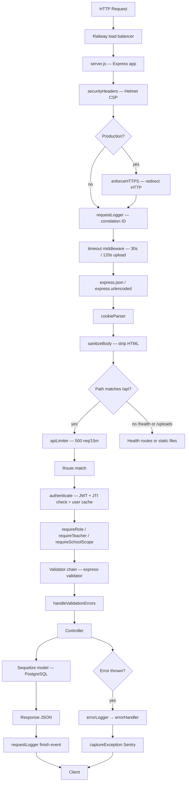
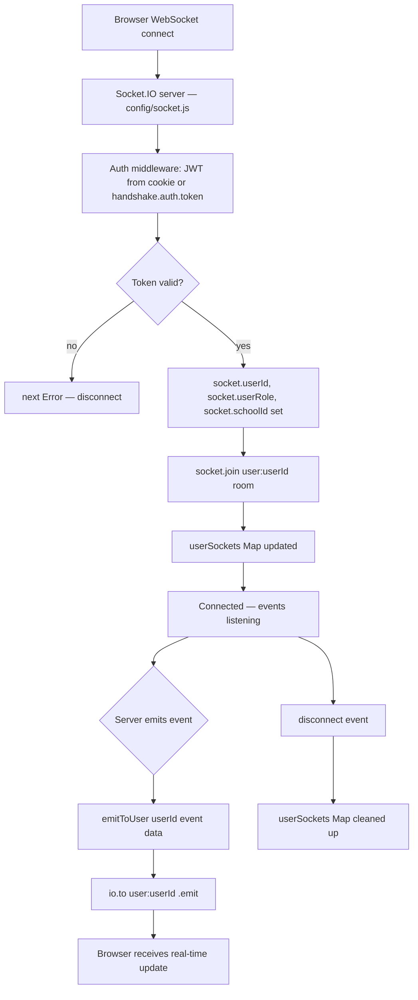

# Backend S0: Understanding

**Generated:** 2026-05-19  
**Status:** Complete (7/7 sections)  
**Honesty note:** Five controllers exceeded 300 lines and were read in chunks (first 300 lines fully, remainder summarized by Explore agent): `mediaController.js` (958 lines), `governmentController.js` (922 lines), `adminStatsController.js` (667 lines), `adminReceptionController.js` (499 lines), `therapyController.js` (544 lines). All claims are cited from verified read lines or agent-reported structure.

---

## Section 1: File Inventory

### Root & Config

| File | Purpose |
|---|---|
| `server.js` (257 lines) | Entry point: bootstraps Express, mounts all routes, initializes Socket.IO, manages graceful shutdown |
| `package.json` | Project manifest; ESM (`"type":"module"`), Node ≥20, 33 prod deps, 8 dev deps |
| `jest.config.js` | Jest config for ESM; 25% coverage threshold (low); collects coverage from controllers/middleware/config/utils |
| `.env.example` | Reference env file; includes Payme/Click payment keys (dead — payment route was deleted) |
| `Dockerfile` | Container spec |
| `nixpacks.toml` | Railway build config |
| `railway.toml` | Railway deployment config |
| `tsconfig.json` | TypeScript config (type-checking only; no TS compilation used) |
| `.eslintrc.cjs` | ESLint config with `eslint-plugin-security` |
| `.nvmrc` | Node version pin |
| `.npmrc` | npm config |

### `config/`

| File | Purpose |
|---|---|
| `database.js` | Sequelize instance; supports `DATABASE_URL` (Railway) or individual DB_* vars; SSL disabled for local |
| `env.js` | Joi validation of all env vars; process exits on failure (fail-fast) |
| `migrate.js` | Custom migration runner: reads `migrations/` dir, tracks executed via `SequelizeMeta` table, idempotent |
| `socket.js` | Socket.IO server init; JWT auth middleware; Redis adapter for multi-instance; `emitToUser` helper; `userSockets` in-memory map |
| `storage.js` | Appwrite file storage (preferred) + local disk fallback; `uploadFile`, `deleteFile`, `getSignedUrl` |
| `swagger.js` | SwaggerJSDoc spec from route JSDoc comments; served at `/api/v1/docs` in non-production |

### `middleware/`

| File | Purpose |
|---|---|
| `auth.js` | JWT authentication; JTI revocation (Redis or in-memory); 30s user cache; role guards: `requireRole`, `requireTeacher`, `requireAdmin`, etc. |
| `errorHandler.js` | Express error handler; formats Sequelize/JWT errors; calls `captureException` for 500s |
| `rateLimiter.js` | 5 limiters: `apiLimiter` (500/15m), `authLimiter` (50/15m), `changePasswordLimiter` (10/15m), `passwordResetLimiter` (3/h), `aiChatLimiter` (20/min), `uploadLimiter` (100/15m) |
| `requestLogger.js` | UUID correlation ID per request; logs start + finish with duration |
| `sanitize.js` | Recursively strips HTML from `req.body` strings using `sanitize-html` |
| `schoolScope.js` | `requireSchoolScope`: attaches `req.schoolId`; `schoolWhere()`: returns `{ schoolId }` or `{}` for government; throws if no schoolId |
| `security.js` | Helmet CSP headers; HTTPS redirect in production (skips `/health`) |
| `upload.js` | Multer: 50 MB media uploads to temp dir; 10 MB document uploads; file type filters |
| `uploadChildren.js` | Multer memory storage: 5 MB image-only uploads for child photos and user avatars |
| `validation.js` | `handleValidationErrors`: extracts `express-validator` errors → 400 response |

### `routes/` (25 files)

| File | Route prefix | Roles | Notes |
|---|---|---|---|
| `health.js` | `/health` | Public | Three endpoints: `/`, `/readiness` (DB check), `/liveness` |
| `authRoutes.js` | `/api/v1/auth` | Public/Authenticated | login, logout, refresh, set-password, unlock-account, admin-register |
| `adminRoutes.js` | `/api/v1/admin` | admin | Reception CRUD, document approval, read-only teachers/parents/groups, statistics |
| `receptionRoutes.js` | `/api/v1/reception` | reception | Document upload, teacher/parent CRUD, group read, messaging |
| `teacherRoutes.js` | `/api/v1/teacher` | teacher+reception+admin | Profile, tasks, responsibilities, work history, parents (read), emotional monitoring, AI chat |
| `parentRoutes.js` | `/api/v1/parent` | parent; admin/reception for `/:parentId/data` | Children, activities, meals, media, profile, ratings, AI chat, evaluations |
| `childRoutes.js` | `/api/v1/child` | authenticated (role-gated per verb) | Child CRUD and avatar |
| `userRoutes.js` | `/api/v1/user` | authenticated | Profile update, avatar, password change |
| `governmentRoutes.js` | `/api/v1/government` | government (most); all authenticated for message POST | Overview, schools, admins, users, messages, admin-registrations |
| `businessRoutes.js` | `/api/v1/business` | business+government | Platform-wide aggregated stats |
| `activityRoutes.js` | `/api/v1/activities` | authenticated; teacher/admin/reception for writes | Activity CRUD with pagination/date/child filters |
| `mediaRoutes.js` | `/api/v1/media` | authenticated; teacher/admin/reception for writes | Media CRUD + Appwrite proxy endpoint |
| `mealRoutes.js` | `/api/v1/meals` | authenticated; teacher/admin for writes | Meal CRUD |
| `groupRoutes.js` | `/api/v1/groups` | authenticated; reception for writes | Group CRUD |
| `chatRoutes.js` | `/api/v1/chat` | authenticated | Parent-teacher messaging with conversation model |
| `notificationRoutes.js` | `/api/v1/notifications` | authenticated | Notification CRUD |
| `progressRoutes.js` | `/api/v1/progress` | parent | Child progress tracking |
| `newsRoutes.js` | `/api/v1/news` | authenticated; admin for writes | School news/announcements |
| `therapyRoutes.js` | `/api/v1/therapy` | authenticated; admin/teacher for writes; parent/teacher for start/end | Therapy library + session tracking |
| `aiWarningRoutes.js` | `/api/v1/ai-warnings` | admin+government | AI-detected warning analysis and resolution |
| `childAssessmentRoutes.js` | `/api/v1/assessments` | authenticated; teacher/admin for writes | Child development assessments |
| `servicePlanRoutes.js` | `/api/v1/service-plans` | authenticated; teacher/admin for writes | Annual therapy service plans |
| `mealPlanRoutes.js` | `/api/v1/meal-plans` | authenticated; teacher/admin for writes | Planned meal schedules |
| `teacherResourceRoutes.js` | `/api/v1/resources` | authenticated; teacher/admin for writes | Teacher music/video/recommendation library |
| `migrationRoutes.js` | `/api/v1/migrations` | Secret-header protected | Manual migration trigger (MIGRATION_SECRET) |

### `models/` (36 files)

| File | Table | Key traits |
|---|---|---|
| `User.js` | `users` | UUID PK; paranoid (soft-delete); bcrypt hooks; roles: admin/reception/teacher/parent/government/business |
| `Child.js` | `children` | Paranoid; schoolId nullable (intake); `class` and `teacher` as STRING (redundant with model relations) |
| `School.js` | `schools` | region/city/director; isActive; indexes on name/type/isActive |
| `Group.js` | `groups` | teacherId FK; schoolId FK; capacity 1–100 |
| `Activity.js` | `activities` | Paranoid; many JSONB fields (tasks, services); indexed on childId+date |
| `Media.js` | `media` | Paranoid; photo/video enum; Appwrite URL stored in `url` |
| `Meal.js` | `meals` | Paranoid; mealType enum (Breakfast/Lunch/Snack/Dinner) |
| `ChatMessage.js` | `chat_messages` | Paranoid; conversationId as string; senderRole enum (parent/teacher); readByParent/readByTeacher |
| `GovernmentMessage.js` | `government_messages` | Self-join (parentMessageId for threading); reply+repliedAt fields |
| `Notification.js` | `notifications` | Not paranoid; userId+childId+schoolId FKs |
| `TeacherRating.js` | `teacher_ratings` | Paranoid; unique on (teacherId, parentId); stars 1–5 |
| `SchoolRating.js` | `school_ratings` | Paranoid; unique on (schoolId, parentId); stars 1–5; numericRating 1–10; evaluation JSONB |
| `EmotionalMonitoring.js` | `emotional_monitoring` | NOT paranoid; unique on (childId, date); emotionalState JSONB (9 boolean fields) |
| `Therapy.js` | `therapies` | Paranoid; ARRAY(STRING) tags; therapyType/ageGroup/difficultyLevel enums |
| `TherapyUsage.js` | `therapy_usages` | Paranoid; tracks therapy sessions; progress 0–100; rating 1–5 |
| `AIWarning.js` | `ai_warnings` | Polymorphic FK (targetType/targetId — no real FK constraint); severity enum |
| `GovernmentStats.js` | `government_stats` | JSONB data blob; 9 composite indexes |
| `BusinessStats.js` | `business_stats` | JSONB data blob; tied to business user |
| `RefreshToken.js` | `refresh_tokens` | hashed (SHA-256); revoked flag; `underscored: false` but `createdAt: 'created_at'` (mixed) |
| `ChildAssessment.js` | `child_assessments` | Paranoid; `underscored: true`; 6 categories; score 1–5; unique on (childId, category, date) |
| `ServicePlan.js` | `service_plans` | Paranoid; `underscored: true`; 8 service types; months as JSONB (12 booleans); unique on (childId, year, serviceType) |
| `MealPlan.js` | `meal_plans` | Paranoid; `underscored: true`; unique on (childId, date, mealType) |
| `TeacherResource.js` | `teacher_resources` | NOT paranoid; music/video/recommendation type enum; URL string |
| `ParentEvaluation.js` | `parent_evaluations` | NOT paranoid; `underscored: true`; answers JSONB; period daily/weekly/monthly |
| `News.js` | `news` | NOT paranoid; schoolId-scoped; targetAudience enum; published flag |
| `Document.js` | `documents` | Paranoid; documentType enum; status pending/approved/rejected |
| `Progress.js` | `progress` | NOT paranoid; unique childId (one progress per child); academic/social/behavioral JSONB |
| `AdminRegistrationRequest.js` | `admin_registration_requests` | telegramUsername required; schoolId FK; status pending/approved/rejected |
| `ParentActivity.js` | `parent_activities` | NOT paranoid; legacy model (pre-group era); parentId-scoped |
| `ParentMeal.js` | `parent_meals` | NOT paranoid; legacy model; parentId-scoped |
| `ParentMedia.js` | `parent_media` | NOT paranoid; legacy model; parentId-scoped |
| `TeacherResponsibility.js` | `teacher_responsibilities` | NOT paranoid; active/completed/cancelled status; low/medium/high/urgent priority |
| `TeacherTask.js` | `teacher_tasks` | NOT paranoid; pending/in_progress/completed/cancelled status |
| `TeacherWorkHistory.js` | `teacher_work_history` | NOT paranoid; deadline field; pending/in_progress/completed/overdue/cancelled; 6 workTypes |
| `AIWarning.js` | `ai_warnings` | Already listed above |
| `index.js` | — | 36 models imported, all associations declared, 3 scope helpers (bySchool, byChild) |

### `controllers/` (46 files)

| File | Lines | Purpose |
|---|---|---|
| `adminController.js` | 7 | Barrel re-export of admin/* subcontrollers |
| `parentController.js` | 9 | Barrel re-export of parent/* subcontrollers |
| `activityController.js` | 461 | Activity CRUD; role-filtered queries; async notifications; JSONB tasks/services |
| `adminRegistrationController.js` | 475 | Admin self-registration → government approval workflow; Appwrite file upload; Telegram notify; email with set-password link |
| `aiWarningController.js` | ~200 | AI rating analysis; warning CRUD; notify users |
| `authController.js` | 356 | Login (bcrypt+lockout), refresh (token rotation), logout (JTI revoke), set-password, unlock-account |
| `businessController.js` | ~200 | Cross-school aggregate stats for business role |
| `chatController.js` | 301 | Parent↔teacher chat; conversation-based; Socket.IO emit; access control per role |
| `childAssessmentController.js` | 230 | Child dev assessments; upsert logic; raw subquery for "latest per category" |
| `childController.js` | ~200 | Child CRUD; photo as base64 data URI in DB; checkChildAccess middleware |
| `emotionalMonitoringController.js` | 408 | Teacher emotional monitoring journal; upsert by childId+date; parent read-only |
| `governmentController.js` | 922 | Government analytics dashboard; overview, schools, students, ratings, admins; stats generation |
| `governmentMessageController.js` | ~200 | Bi-directional messaging; threading via parentMessageId |
| `groupController.js` | 235 | Group CRUD; scoped by school; complex admin→reception→teacher hierarchy filter |
| `mealController.js` | 328 | Meal CRUD; N+1 query (teacher path: parents→children→meals — 3 queries); Socket.IO emit |
| `mealPlanController.js` | ~200 | Meal plan CRUD; findOrCreate upsert; bulk endpoint |
| `mediaController.js` | 958 | Media upload (Appwrite); Appwrite proxy; role-filtered queries; sharp thumbnail generation (dynamic import) |
| `newsController.js` | 189 | News CRUD; school-scoped; published gate for non-admins |
| `notificationController.js` | 205 | Notification CRUD; `createNotification` helper emits socket event |
| `parentEvaluationController.js` | ~80 | Parent self-evaluation submit/list; 50-record limit (no pagination) |
| `progressController.js` | 85 | Child progress get/update; ALLOWED_FIELDS whitelist; auto-create if missing |
| `receptionController.js` | ~150 | Reception doc upload; isVerified set on upload (questionable); verification status |
| `receptionParentController.js` | ~350 | Parent+child CRUD by reception; complex bracket-notation field parsing; atomic delete cascade |
| `receptionTeacherController.js` | ~150 | Teacher CRUD by reception; teacher ratings aggregation |
| `servicePlanController.js` | 172 | Service plan upsert; bulk upsert; fills in 8 default rows |
| `teacherAIController.js` | ~150 | AI chat; OpenRouter with model fallback; rule-based fallback if all fail |
| `teacherController.js` | 242 | Teacher profile, dashboard counts, parents/children lists |
| `teacherResourceController.js` | ~150 | Resource CRUD; URL normalization |
| `teacherTaskController.js` | ~200 | Responsibilities/tasks/work-history CRUD; overdue summary |
| `therapyController.js` | 544 | Therapy library CRUD; session start/end; usage tracking; ratings |
| `userController.js` | 128 | Profile update; avatar as base64 data URI; password change |
| `admin/adminMessageController.js` | 27 | Admin: list messages sent to government (read-only) |
| `admin/adminParentController.js` | 141 | Admin views parents (createdBy chain scoping) |
| `admin/adminReceptionController.js` | 499 | Admin CRUD for receptions; document approve/reject; auto-activate on full approval |
| `admin/adminStatsController.js` | 667 | Admin dashboard stats; raw SQL for ratings; graceful fallback for each stat |
| `admin/adminTeacherController.js` | 61 | Admin views teachers (createdBy chain scoping, read-only) |
| `admin/adminUserController.js` | 361 | Government manages admin/government accounts; password strength; self-delete guard |
| `parent/parentActivityController.js` | 149 | Parent views activities; modern (Group-based) vs. legacy (ParentActivity) branches |
| `parent/parentAIController.js` | 289 | Parent AI chat; child context injected; Uzbek fallback responses; free-model race |
| `parent/parentChildController.js` | 26 | Parent views own children |
| `parent/parentMealController.js` | 149 | Parent views meals; same branching as activities |
| `parent/parentMediaController.js` | 113 | Parent views media |
| `parent/parentMessageController.js` | 27 | Parent lists messages to government |
| `parent/parentProfileController.js` | 124 | Parent profile + `getParentData` for admin/reception |
| `parent/parentSchoolRatingController.js` | 251 | Parent rates school; extensive validation; school lookup/create by name |
| `parent/parentTeacherRatingController.js` | 105 | Parent rates assigned teacher; recalculates User.rating after each upsert |

### `utils/` (13 files)

| File | Purpose |
|---|---|
| `email.js` | SMTP/Gmail/no-op transporter; `sendAdminApprovalEmail` (set-password link, no plaintext) |
| `errorTracker.js` | Sentry conditional init; `captureException` no-op if DSN unset |
| `governmentLevel.js` | 3-format rating normalization (JSONB eval > numericRating > stars); level 1–5; sort helpers |
| `logger.js` | Winston; PII redaction (email → [REDACTED_EMAIL], secrets → [REDACTED]); JSON in prod, colorized in dev |
| `loginRateLimitStore.js` | Login lockout (5 attempts / 15 min); Redis primary, in-memory fallback (fail-open) |
| `pagination.js` | `parsePagination` → `{ limit, offset }`; max 100; default 20 |
| `parentDataSource.js` | `getParentGroupId(userId)` → groupId or null |
| `queryValidator.js` | Positive integer parsing for query params (limit/offset/page) |
| `redisClient.js` | Singleton ioredis; lazy init; `null` if REDIS_URL unset; `_resetClientForTest` |
| `redisRateLimitStore.js` | express-rate-limit v7 Redis store; atomic Lua INCR+EXPIRE; unique prefix required |
| `schoolValidation.js` | `validateChildAccess`: intake children accessible to parent+government; scoped access for others |
| `telegram.js` | Telegram Bot API; `sendAdminApprovalTelegram` tries 3 methods; username→chatId via `getUpdates` (fragile) |
| `uuidValidator.js` | `isUUID(v)` — v4 UUID regex |

### `validators/` (26 files)

| File | Validates |
|---|---|
| `activityValidator.js` | Activity create/update fields |
| `adminValidator.js` | Reception create; document reject; ID param |
| `aiChatValidator.js` | AI chat message + language |
| `aiWarningValidator.js` | Warning analysis; resolve; notify |
| `authValidator.js` | Login (email, password) |
| `businessValidator.js` | Stats generate params |
| `chatValidator.js` | Message content; mark-read; update |
| `childAssessmentValidator.js` | Assessment create/update |
| `childValidator.js` | Child create/update; UUID param |
| `governmentUserValidator.js` | Admin/government user create/update/delete |
| `groupValidator.js` | Group create/update; UUID param |
| `mealPlanValidator.js` | Meal plan create/update/bulk |
| `mealValidator.js` | Meal create/update |
| `mediaValidator.js` | Media create/update |
| `messageValidator.js` | Government message send |
| `newsValidator.js` | News create/update |
| `parentRatingValidator.js` | Teacher rate; school rate; parent evaluation |
| `progressValidator.js` | Progress update |
| `queryValidator.js` | Pagination; date; childId query params |
| `receptionValidator.js` | Reception staff create; parent create |
| `servicePlanValidator.js` | Service plan upsert/bulk |
| `teacherResourceValidator.js` | Resource create; UUID param |
| `teacherTaskValidator.js` | Task status update; emotional monitoring create/update |
| `teacherValidator.js` | Teacher create/update |
| `therapyValidator.js` | Therapy create/update; end-therapy; UUID param |
| `userValidator.js` | Profile update; password change |

All validators use `express-validator` chain API (`body()`, `param()`, `query()`); collected by `handleValidationErrors` middleware.

### `migrations/` (55 files)

Listed chronologically; purpose inferred from name (all confirmed not ambiguous except where noted):

| Filename | Purpose |
|---|---|
| `20240101000000-initial-schema.js` | Create initial tables (users, documents, activities, media, meals, etc.) |
| `20240102000000-update-role-based-schema.js` | Add role-based columns to users |
| `20240103000000-create-refresh-tokens.js` | refresh_tokens table |
| `20250115000000-add-telegram-username.js` | Add telegramUsername to admin_registration_requests |
| `20260108000000-create-teacher-ratings.js` | teacher_ratings table |
| `20260110000010-create-chat-messages.js` | chat_messages table |
| `20260111000000-add-individual-plan-fields.js` | Add individual plan fields to activities |
| `20260112000000-create-super-admin-messages.js` | Create super_admin_messages (renamed later) |
| `20260113000000-create-admin-registration-requests.js` | admin_registration_requests table |
| `20260114000000-update-admin-registration-requests.js` | Update admin registration request schema |
| `20260115000000-create-emotional-monitoring.js` | emotional_monitoring table |
| `20260116000000-create-therapies.js` | therapies + therapy_usages tables |
| `20260117000000-add-government-business-roles.js` | Add government/business role ENUMs |
| `20260117100000-create-schools.js` | schools table |
| `20260118000000-create-payments.js` | payments table (dropped later) |
| `20260201000000-add-rating-fields-to-users.js` | Add rating/totalRatings to users |
| `20260202000000-add-numeric-rating-to-school-ratings.js` | Add numericRating column |
| `20260203000000-make-stars-required-in-school-ratings.js` | ALTER stars to NOT NULL |
| `20260204000000-create-school-ratings.js` | school_ratings table |
| `20260205000000-add-evaluation-to-school-ratings.js` | Add evaluation JSONB column |
| `20260330000000-add-missing-fk-indexes.js` | Add FK indexes (performance) |
| `20260330000001-add-soft-deletes.js` | Add deletedAt columns to key tables |
| `20260401000000-expand-child-profile.js` | Add medical/family/emergency fields to children |
| `20260401000001-create-child-assessments.js` | child_assessments table |
| `20260401000002-create-service-plans.js` | service_plans table |
| `20260401000003-create-meal-plans.js` | meal_plans table |
| `20260401000010-add-school-id-to-users-groups.js` | schoolId FK on users and groups |
| `20260401000011-add-school-id-to-registration-requests.js` | schoolId on admin_registration_requests |
| `20260402000000-create-teacher-resources.js` | teacher_resources table |
| `20260422000000-create-parent-evaluations.js` | parent_evaluations table |
| `20260423000000-avatar-text-column.js` | Change avatar to TEXT (for base64 data URIs) |
| `20260506000000-add-cascade-rules.js` | Add ON DELETE CASCADE/SET NULL rules |
| `20260506000001-add-extended-soft-deletes.js` | Extend paranoid to more tables |
| `20260506100000-drop-push-notifications.js` | Drop push notification table |
| `20260506110000-drop-payments.js` | Drop payments table (CONFIRMED: payment system removed) |
| `20260506120000-promote-super-admin-to-government.js` | Rename super_admin role → government |
| `20260506130000-add-camel-case-fk-indexes.js` | Add camelCase FK indexes for Sequelize |
| `20260508000001-fix-fk-index-column-names.js` | Fix FK index column names |
| `20260508000002-school-rating-stars-not-null.js` | stars NOT NULL constraint fix |
| `20260510000000-rename-government-messages-table.js` | Rename super_admin_messages → government_messages |
| `20260510000001-make-child-school-nullable.js` | schoolId nullable on children (intake flow) |
| `20260510000002-normalize-meal-plan-type-case.js` | Fix mealType enum casing |
| `20260510000003-fix-restrict-fk-cascades.js` | Fix restrict vs. cascade FKs |
| `20260510000004-add-paranoid-to-document-chat-assessment.js` | Add deletedAt to documents, chat_messages, child_assessments |
| `20260510000005-add-missing-user-indexes.js` | Add user indexes (role, schoolId, teacherId, groupId) |
| `20260512000001-drop-child-school-string.js` | Drop school string column from children |
| `20260514000001-reset-admin-gov-passwords.js` | One-off: reset admin/government passwords |
| `20260514000002-rename-deletedAt-to-deleted_at.js` | Normalize deletedAt column casing |
| `20260514000003-add-schoolId-to-news.js` | schoolId on news table |
| `20260514000004-add-schoolId-to-notifications.js` | schoolId on notifications table |
| `20260514000005-reset-gov-admin-business-passwords.js` | One-off: reset passwords |
| `20260517000001-add-government-stats-composite-indexes.js` | Composite indexes on government_stats |
| `20260517000002-fix-government-stats-fk-on-delete.js` | Fix ON DELETE for government_stats |
| `20260518100000-add-school-region-city-director.js` | Add region/city/director columns to schools |
| `20260518100001-add-message-threading.js` | Add parentMessageId to government_messages |

### `scripts/` (22 files)

| File | Purpose | Danger |
|---|---|---|
| `_setup-db.mjs` | One-time database setup | Medium |
| `add-user-columns.js` | Add missing columns to users | Low (idempotent) |
| `backfill-school-ids.js` | Backfill schoolId on users from reception.schoolId | Medium |
| `backfill-school-ids-v2.js` | V2 backfill with improved logic | Medium |
| `backfill-school-region-city.js` | Backfill region/city on schools | Low |
| `check-auth.js` | Dev diagnostic: verify JWT config | Info only |
| `cleanup-audit.js` | Audit orphaned/incomplete data | Read-only |
| `cleanup-audit-v2.js` | V2 audit with additional checks | Read-only |
| `create-admin.js` | Create admin user in DB | Medium (write user) |
| `create-database.js` | Create PostgreSQL database | High (DDL) |
| `create-demo-accounts.js` | Seed demo users | Medium (PII risk) |
| `create-government.js` | Create government user | Medium |
| `create-reception.js` | Create reception user | Medium |
| `create-teacher.js` | Create teacher user | Medium |
| `fix-varchar-limits.js` | Fix column VARCHAR size limits | Medium |
| `list-tables.js` | List all DB tables | Read-only |
| `remove-demo-users.js` | Remove demo accounts | Medium (destructive) |
| `reset-admin-password.js` | Reset admin password | High |
| `reset-database.js` | **DROPS all tables** | **CRITICAL — destructive** |
| `reset-password.ps1` | PowerShell wrapper for password reset | High |
| `seed.js` | Seed initial data | Medium |
| `test-connection.js` | Test DB connectivity | Info only |

### `__tests__/` (68 files)

See agent-reported list above (not repeated here). Pattern: 1 test file per controller/feature area + dedicated middleware and utils tests + 2 integration tests + helpers.

---

## Section 2: Entry Points and Request Flow

### HTTP Request Flow



### Socket.IO Flow



**Current socket events emitted by backend:**
- `notification:new` (notificationController)
- `meal:created`, `meal:updated`, `meal:deleted` (mealController)
- `user:updated` (userController, childController)
- `chat:message` (chatController)
- `activity:*` (activityController — inferred)

---

## Section 3: Module Map

```
backend/
├── Infrastructure
│   ├── config/database.js       ← Sequelize instance (imported by models, migrate.js)
│   ├── config/env.js            ← Env validation (imported at server startup)
│   ├── config/migrate.js        ← Migration runner (standalone + dynamic import)
│   ├── config/socket.js         ← Socket.IO server (exported io, emitToUser)
│   ├── config/storage.js        ← Appwrite + local disk (imported by controllers)
│   └── config/swagger.js        ← API docs spec
│
├── HTTP Request Pipeline
│   ├── server.js                ← Wires everything; imports all routes
│   ├── middleware/security.js   ← First: Helmet + HTTPS
│   ├── middleware/requestLogger.js ← Correlation IDs
│   ├── middleware/sanitize.js   ← Body sanitization
│   ├── middleware/rateLimiter.js ← Rate limits (Redis-backed)
│   ├── middleware/auth.js       ← JWT + JTI revocation (Redis/in-memory)
│   ├── middleware/schoolScope.js ← School isolation
│   ├── middleware/upload.js     ← Multer (Appwrite)
│   ├── middleware/uploadChildren.js ← Multer memory (avatars)
│   ├── middleware/validation.js ← express-validator errors
│   └── middleware/errorHandler.js ← Final error handler
│
├── Business Logic
│   ├── controllers/*            ← All feature controllers
│   ├── validators/*             ← Request validation chains
│   └── utils/schoolValidation.js ← Child access scoping
│
├── Data Layer
│   ├── models/index.js          ← Associations hub
│   ├── models/*.js              ← 36 Sequelize models
│   └── config/database.js       ← Sequelize connection
│
├── Shared Services
│   ├── utils/logger.js          ← Winston (used everywhere)
│   ├── utils/email.js           ← SMTP (used by adminRegistrationController)
│   ├── utils/telegram.js        ← Telegram Bot (used by adminRegistrationController)
│   ├── utils/errorTracker.js    ← Sentry (used by errorHandler)
│   ├── utils/redisClient.js     ← Redis singleton
│   ├── utils/loginRateLimitStore.js ← Login lockout
│   ├── utils/redisRateLimitStore.js ← express-rate-limit Redis store
│   ├── utils/governmentLevel.js ← Rating calculations
│   └── utils/pagination.js     ← Pagination helpers
│
├── DB Operations
│   ├── migrations/              ← 55 sequential migrations
│   └── scripts/                 ← 22 one-off operational scripts
│
└── Tests
    └── __tests__/               ← 68 test files (Jest + Supertest + SQLite)
```

**Coupling notes:**
- `config/socket.js` → `models/User.js`, `utils/redisClient.js` (tight)
- `controllers/notificationController.js` imported by 4+ other controllers (tight coupling via `createNotification`)
- `utils/schoolValidation.js` imported by 8+ controllers (shared guard)
- `controllers/adminController.js` + `controllers/parentController.js` are barrel files (no logic)
- Legacy `ParentActivity/ParentMeal/ParentMedia` models exist alongside modern `Activity/Meal/Media` — branching in parent sub-controllers creates dual code paths

---

## Section 4: Data Model

### Entity Relationship Overview (Sequelize associations from `models/index.js`)

```
School (1) ──────────────────────────────────────────────── many Users (schoolId)
School (1) ──────────────────────────────────────────────── many Groups (schoolId)
School (1) ──────────────────────────────────────────────── many Children (schoolId, nullable)
School (1) ──────────────────────────────────────────────── many SchoolRatings (schoolId)
School (1) ──────────────────────────────────────────────── many AIWarnings (schoolId)
School (1) ──────────────────────────────────────────────── many GovernmentStats (schoolId)
School (1) ──────────────────────────────────────────────── many TeacherResources (schoolId)

User (teacher) (1) ─────────────────────────────────────── many Groups (teacherId)
User (parent)  (1) ─────────────────────────────────────── many Children (parentId)
User (1)       ─────────────────────────────────────────── one Group (groupId, parent's group)
User (1)       ─────────────────────────────────────────── one User (teacherId — parent→teacher assignment)
User (1)       ─────────────────────────────────────────── many TeacherResponsibility / Task / WorkHistory
User (1)       ─────────────────────────────────────────── many Document / Notification
User (1)       ─────────────────────────────────────────── many RefreshToken
User (1)       ─────────────────────────────────────────── many TeacherRating (as teacher + as parent)
User (1)       ─────────────────────────────────────────── many GovernmentMessage (senderId)
User (1)       ─────────────────────────────────────────── many News (createdById)
User (1)       ─────────────────────────────────────────── many ParentEvaluation (parentId + teacherId)

Group (1) ──────────────────────────────────────────────── many Children (groupId)

Child (1) ──────────────────────────────────────────────── one  Progress
Child (1) ──────────────────────────────────────────────── many Activity / Meal / Media
Child (1) ──────────────────────────────────────────────── many ChildAssessment / ServicePlan / MealPlan
Child (1) ──────────────────────────────────────────────── many EmotionalMonitoring / TherapyUsage / Notification

Activity (1) ───────────────────────────────────────────── many Media (activityId, nullable)
Therapy (1) ────────────────────────────────────────────── many TherapyUsage

ChatMessage ─────────────────────────────────────────────── no Child FK (conversationId = "parent:<userId>")
GovernmentMessage (1) ───────────────────────────────────── many GovernmentMessage (replies, self-join)
AIWarning ───────────────────────────────────────────────── polymorphic targetId (no real FK)
```

**"Intake" children:** `Child.schoolId = null` means child is enrolled but not yet school-assigned. `schoolValidation.validateChildAccess` allows parent+government access to intake children; scoped users (admin/reception) cannot see them until assigned.

**Legacy entities (active but superseded):** `ParentActivity`, `ParentMeal`, `ParentMedia` — direct parent-linked records; modern path uses `Activity/Meal/Media` via group→children.

---

## Section 5: External Dependencies

### Production npm Packages

| Package | Purpose |
|---|---|
| `express` ^4.18.2 | HTTP framework |
| `sequelize` ^6.35.2 | ORM (PostgreSQL) |
| `pg` ^8.11.3 | PostgreSQL driver |
| `pg-hstore` ^2.3.4 | Sequelize PostgreSQL support |
| `socket.io` ^4.8.3 | Real-time WebSocket |
| `@socket.io/redis-adapter` ^8.3.0 | Socket.IO Redis pub/sub adapter |
| `ioredis` ^5.10.1 | Redis client |
| `jsonwebtoken` ^9.0.2 | JWT sign/verify |
| `bcryptjs` ^3.0.3 | Password hashing |
| `cookie-parser` ^1.4.7 | Cookie parsing |
| `cors` ^2.8.5 | CORS middleware |
| `helmet` ^7.1.0 | Security headers |
| `express-rate-limit` ^7.1.5 | Rate limiting |
| `express-validator` ^7.0.1 | Request validation |
| `joi` ^17.11.0 | Schema validation (env vars only) |
| `multer` ^2.1.1 | File uploads |
| `sharp` ^0.33.0 | Image thumbnail generation |
| `node-appwrite` ^24.1.0 | Appwrite file storage SDK |
| `openai` ^4.104.0 | OpenAI/OpenRouter AI API |
| `axios` ^1.13.4 | HTTP client (Telegram, OpenRouter) |
| `sanitize-html` ^2.17.2 | HTML sanitization |
| `validator` ^13.11.0 | String validation helpers |
| `uuid` ^9.0.1 | UUID generation |
| `nodemailer` ^8.0.7 | Email sending |
| `winston` ^3.11.0 | Structured logging |
| `@sentry/node` ^10.37.0 | Error tracking |
| `dotenv` ^16.3.1 | Env var loading |
| `file-type` ^19.6.0 | MIME type detection |
| `iconv-lite` ^0.7.1 | Character encoding |
| `swagger-jsdoc` ^6.2.8 | OpenAPI spec generation |
| `swagger-ui-express` ^5.0.1 | Swagger UI server |

### Dev npm Packages

| Package | Purpose |
|---|---|
| `jest` ^30.2.0 | Test framework |
| `supertest` ^7.2.2 | HTTP integration testing |
| `sqlite3` ^5.1.7 | In-memory test database |
| `@faker-js/faker` ^10.2.0 | Test data generation |
| `nodemon` ^3.0.2 | Dev auto-restart |
| `eslint` + `eslint-plugin-security` | Linting with security rules |
| TypeScript packages | Type-checking only (no compilation) |

### External Services

| Service | Config | How connected |
|---|---|---|
| **Railway PostgreSQL** | `DATABASE_URL` env | Sequelize; SSL with `rejectUnauthorized: false` |
| **Redis** (optional) | `REDIS_URL` env | ioredis singleton; used for rate limiting, JTI revocation, Socket.IO adapter |
| **Appwrite** (optional) | `APPWRITE_*` env vars | `node-appwrite` SDK; stores uploaded media files |
| **OpenAI / OpenRouter** | `OPENAI_API_KEY`, `OPENAI_BASE_URL`, `OPENAI_MODEL` | `openai` SDK; AI chat features |
| **Telegram Bot API** | `TELEGRAM_BOT_TOKEN`, `TELEGRAM_CHANNEL_ID` | `axios` HTTP; admin approval notifications |
| **SMTP / Gmail** | `EMAIL_*` env vars | `nodemailer`; admin approval emails |
| **Sentry** (optional) | `SENTRY_DSN` env | `@sentry/node`; error tracking |

---

## Section 6: Conventions Observed

### Naming
- **Files:** camelCase (controllers, utils, validators, routes); PascalCase (models)
- **Tables:** snake_case (`users`, `child_assessments`, `teacher_work_history`)
- **Model fields:** camelCase in Sequelize; mixed with `underscored: true` on newer models (ChildAssessment, ServicePlan, MealPlan, ParentEvaluation, RefreshToken) — *inconsistent*
- **Exports:** named exports throughout (no default controller objects)

### Error Handling Pattern (from `authController.js:174`, `groupController.js:81`, `mealController.js:109`)
```js
try {
  // ... work ...
} catch (error) {
  logger.error('Descriptive error label', { error: error.message, stack: error.stack });
  res.status(500).json({ error: 'Human-readable message' });
}
```
Controllers catch errors and return 500 directly (bypassing Express error handler) in most cases. The Express `errorHandler` is only reached via `next(err)` patterns (rare in controllers).

### Response Shape
No strict envelope standard — varies by controller:
- Some return bare objects: `res.json(meal)` (`mealController.js:242`)
- Some use `{ success: true, data: ... }`: `notificationController.js:44`
- Some use `{ data: ... }`: `childAssessmentController.js:53`
- Auth uses `{ success: true, user: ..., expiresIn: ... }`: `authController.js:168`

### Async Pattern
100% async/await. No callbacks. No `.then()` chains. (`server.js:236`, `authController.js:43`)

### Import Style
ES Modules throughout (`import`/`export`). No `require()`. (`package.json:6` `"type":"module"`)

### Validation
Two-layer approach:
1. `express-validator` chains in `validators/*.js` → collected by `handleValidationErrors` middleware
2. Additional inline validation in controllers (UUID checks, range checks, business rules)

### Logging
All controllers use `logger` from `utils/logger.js`. Log levels: `info` for normal operations, `warn` for expected failures, `error` for exceptions. PII redacted via Winston format. (`logger.js:20–35`)

### School Scoping Pattern
Middleware (`requireSchoolScope`) + utility (`schoolWhere()`) + `validateChildAccess()` form the three-layer isolation system. Government role gets `req.isGlobalAccess = true`. (`schoolScope.js:1–33`)

### Business Logic Location
- **Mostly in controllers** — good
- **Some leaks into routes** — `mediaRoutes.js:32–57` has inline validators; `chatRoutes.js` is clean
- **Models have light logic** — mostly field validation; `Progress.js:28` directly declares association (dual location with `index.js`)

---

## Section 7: Open Questions

1. **`.env.example` has Payme/Click payment keys (lines 64–74)** — payment controller was deleted (`20260506110000-drop-payments.js`). Are these env vars still in Railway? Do they need to be removed from the example file?

2. **`Child.class` and `Child.teacher` as STRING fields** (`Child.js:56–63`) — these duplicate group/teacher relationships. Are they still written anywhere? Are they read in frontend? Could be dead columns.

3. **Legacy `ParentActivity`, `ParentMeal`, `ParentMedia` models** — used in the "legacy path" of parent sub-controllers when `groupId = null`. Is there still live data in these tables? What's the migration path to fully deprecate them?

4. **`receptionController.js`** — sets `isVerified = true` on document upload. This seems premature; verification should happen on Admin approval, not upload. Intentional or bug? (Needs code verification — not fully read.)

5. **`governmentController.js` (922 lines)** — only first 300 lines read directly. The `getRatingsStats`, `generateStats`, `getSavedStats`, `getAdmins`, `getAdminDetails`, `getTeachersList`, `getParentsList` functions are summarized but not line-cited. A full audit must re-read lines 300–922.

6. **`mediaController.js` (958 lines)** — only first 300 lines read directly. The `createMedia`, `updateMedia`, `deleteMedia`, `proxyMediaFile` functions are summarized but not line-cited. Full audit must re-read lines 300–958.

7. **`adminStatsController.js` (667 lines)** — only summarized; raw SQL queries not inspected for injection risk. Full audit must read entirely.

8. **`tsconfig.json` present** but no TypeScript files exist. Dead artifact?

9. **`config/swagger.js` only scans `routes/*.js`** — no actual JSDoc annotations observed in any route file during reading. Is Swagger spec actually populated?

10. **Socket.IO `userSockets` Map** is in-memory only — the Redis adapter fans out *events* across instances but the `userSockets` Map is per-instance. Is `emitToUser` using `io.to(room)` (which goes through Redis adapter) or the local Map? Need to verify `socket.js:110–121`.

11. **`scripts/reset-database.js`** drops all tables. Is it protected from accidental execution? CLAUDE.md warns never to set `FORCE_SYNC=true` but doesn't mention this script.

12. **Coverage threshold is 25%** (`jest.config.js:16–19`) — very low. What is the actual current coverage?

13. **`parentEvaluationController.js`** hard-limits to 50 records with no pagination parameter (`getMyEvaluations`). Is this intentional?

14. **`utils/telegram.js` `getUserChatIdByUsername`** scrapes `getUpdates` API — this only works if the user has messaged the bot recently, and is not reliable for new approvals. Is this known?
